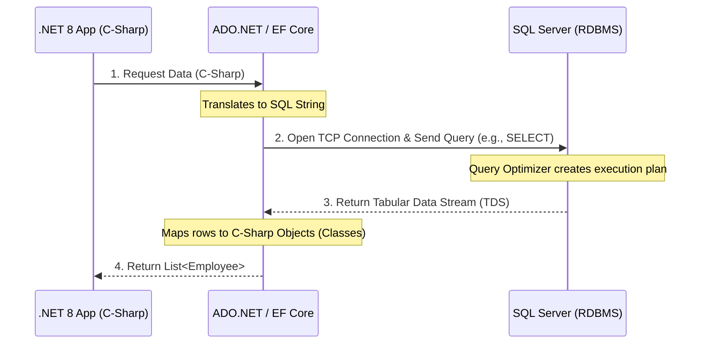
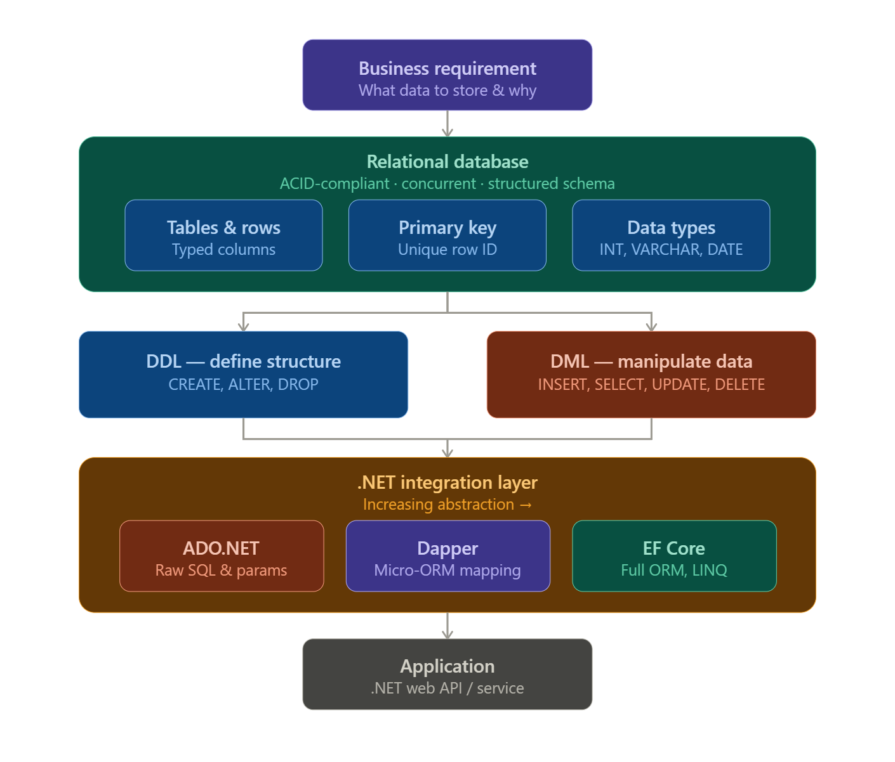
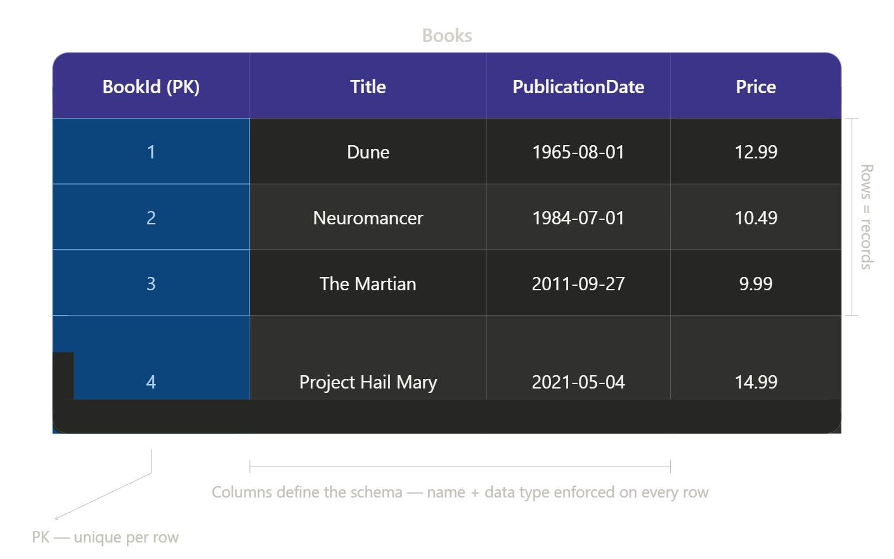
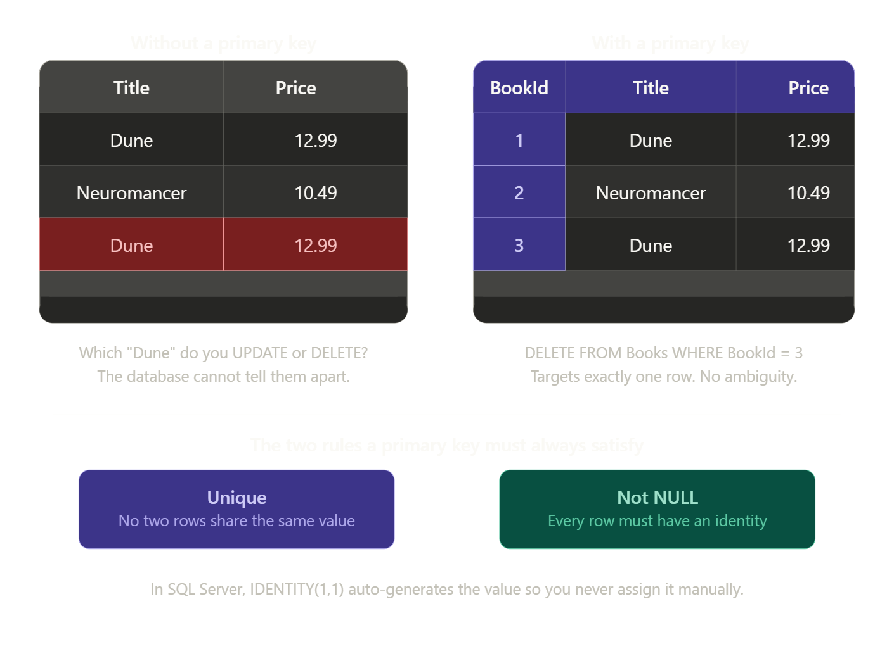
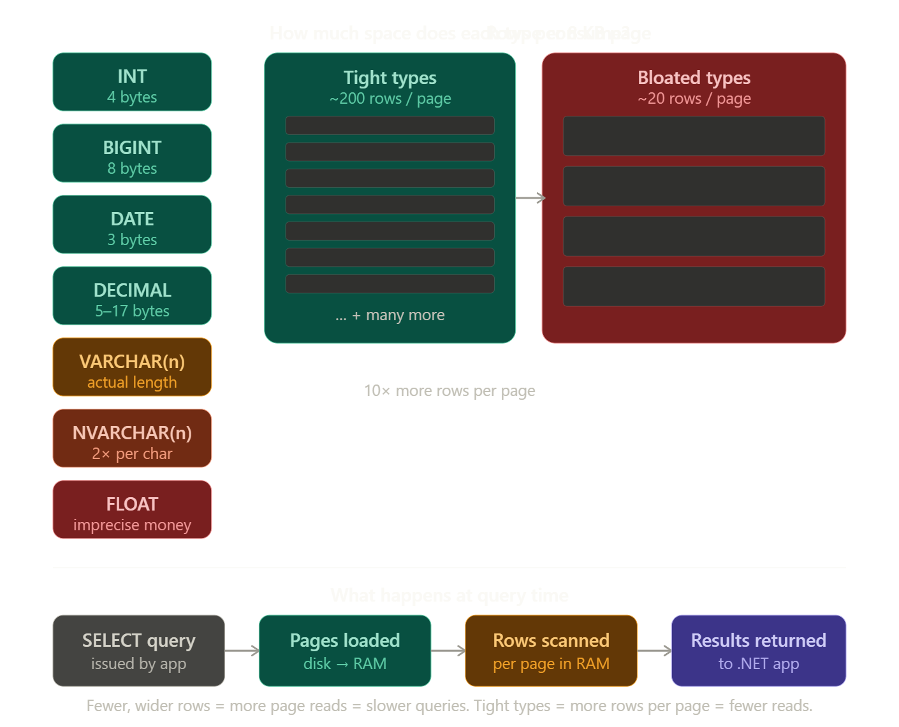
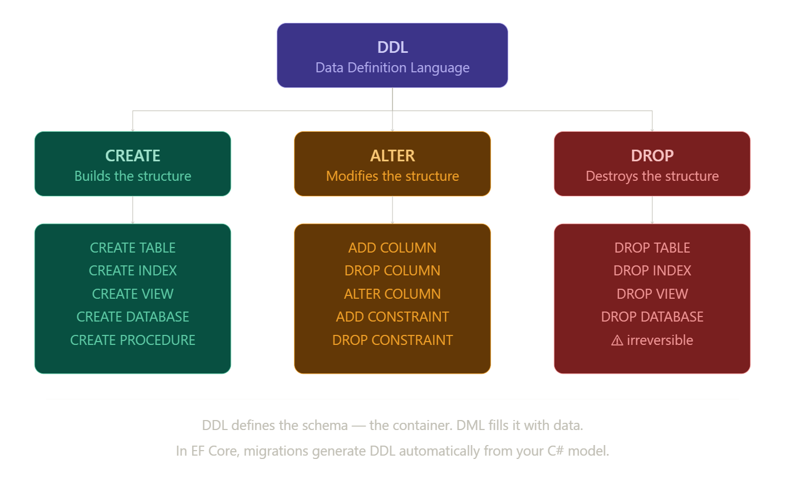
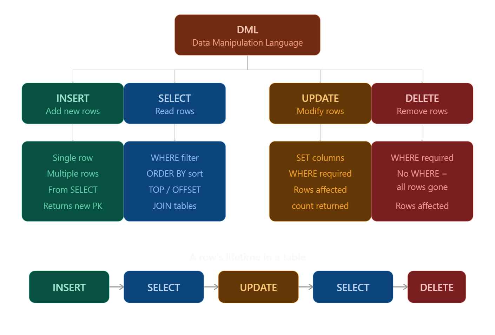
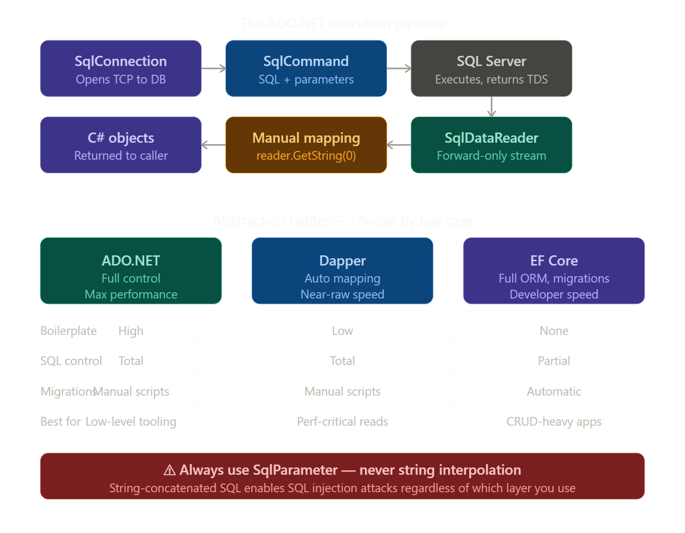
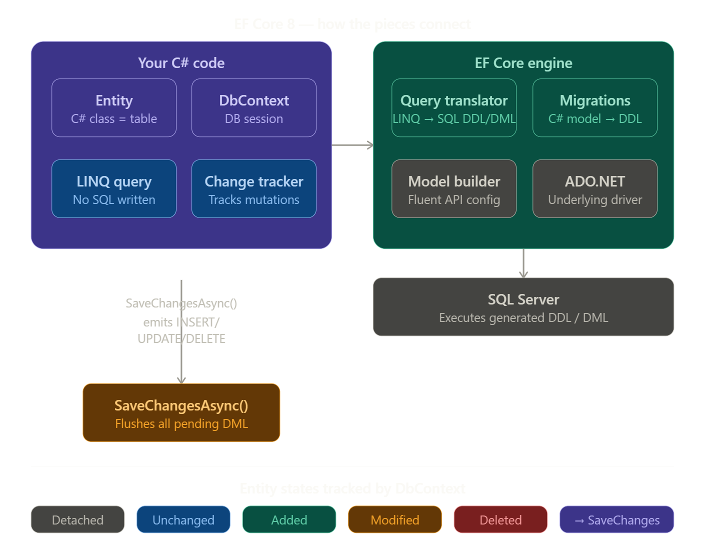
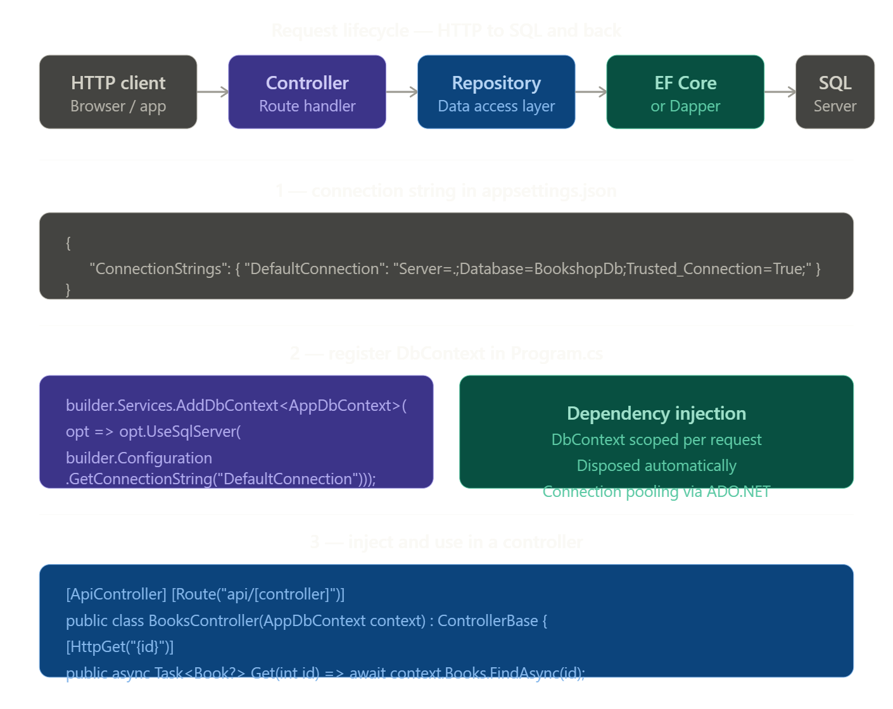

# Grokking Relational Database Design: Chapter 1 Masterclass

**Introduction to Databases, SQL, and .NET Integration**

## 1. CHAPTER OVERVIEW & LEARNING OBJECTIVES

### Chapter Summary

Chapter 1 introduces the absolute bedrock of data persistence: the **relational database**. It moves you away from thinking about data as _unstructured files_ or _spreadsheets_, and introduces the formal anatomy of `tables`, `rows`, `columns`, and `data types`. Furthermore, it introduces **Structured Query Language** (SQL)—the universal language used to define and manipulate this data. From a .NET perspective, this chapter is foundational because every robust application requires a **reliable**, **structured way to store state**. Understanding how the database organizes this state is the first step before writing any data-access C# code.

### Learning Objectives

By the end of this chapter and guide, you will be able to:

1. **Differentiate** between flat-file storage (like spreadsheets) and relational database management systems (RDBMS).

2. **Deconstruct** the anatomy of a database table into its constituent parts: `rows` (records), `columns` (attributes), and `data types`.

3. **Identify and implement** `Primary Keys` to guarantee data uniqueness and entity integrity.

4. **Categorize and write** standard SQL statements into _Data Definition Language_ (DDL) and _Data Manipulation Language_ (DML).

5. **Map** SQL relational data types and concepts to their corresponding .NET 8 / C# 12 structures.

6. **Execute** fundamental SQL queries securely from a .NET application using `ADO.NET`, preventing common vulnerabilities like _SQL Injection_.

### Setting the Stage

Without mastering **tables**, **keys**, and **basic SQL**, advanced topics like **normalization**, **indexing**, **database architecture**, and **ORMs** (like Entity Framework Core) will seem like magic. This chapter replaces that magic with mechanics.

### The Key Problem Solved

"How do we store, retrieve, and guarantee the structural integrity of application data in a way that is **highly performant**, **concurrent**, and **scalable**?"

## 2. CONCEPT BREAKDOWN WITH VISUAL DIAGRAMS

### Concept 1: The Relational Database vs. Flat Files

- **ELI5**: A flat file (like _Excel_) is like a giant junk drawer where you can put **anything anywhere**. A relational database is like a highly organized filing cabinet where every folder has a **strict template**, and folders can mathematically link to one another.

- **Technical**: An RDBMS stores data in structured, **two-dimensional tables defined by a strict schema**. Unlike flat files, an RDBMS enforces `data types`, `constraints`, and `relationships`, while providing `ACID` (Atomicity, Consistency, Isolation, Durability) guarantees for concurrent access.

- **Why it matters in .NET**: When building web APIs (e.g., `ASP.NET Core`), thousands of users might try to book the same flight simultaneously. _Excel_ would corrupt, an RDBMS handles it safely.

### Concept 2: Tables, Columns, and Rows

- **Definition: Table (Entity)**: A distinct collection of related data (e.g., `Users`).
  - **Column (Attribute)**: The structure/properties of the data, enforcing a specific Data Type (e.g., `Email` must be text).

  - **Row (Tuple/Record)**: A single instance of data (e.g., one specific user).

- **Misconception**: Rows have a guaranteed physical order.
- **Correction**: Tables represent mathematical sets. Rows have no inherent order unless explicitly sorted using an ORDER BY SQL clause.

### Concept 3: The Primary Key (PK)

- **Definition**: A column (or set of columns) that uniquely identifies every row in a table. It cannot be `NULL`, and it must be absolutely **unique**.

- **Why it matters**: Without a PK, you cannot reliably target a specific record to _update_ or _delete_ it. In .NET, PKs are essential for Entity Framework to track object state.

### Concept 4: SQL (DDL vs. DML)

- **DDL (Data Definition Language)**: Defines the structure (`CREATE TABLE`, `ALTER`, `DROP`). It is the architecture.

- **DML (Data Manipulation Language)**: Manipulates the data inside the structure (`INSERT`, `SELECT`, `UPDATE`, `DELETE`). It is the interior decoration.

## Visual Diagrams

### Diagram A: The Anatomy of a Table (ASCII Art)

Table: Employees (Entity)

| EmpId (PK) | FirstName (VARCHAR) | LastName (VARCHAR) | HireDate (DATE) |
| ---------- | ------------------- | ------------------ | --------------- |
| 1          | Jane                | Doe                | 2022-01-15      |
| 2          | John                | Smith              | 2023-03-10      |
| 3          | Alice               | Johnson            | 2023-06-22      |

> **PK — Primary Key**: Uniquely identifies each row. No two rows can share the same `EmpId`.

### Diagram B: SQL Execution Architecture (Mermaid)



## 3. COMPREHENSIVE CODE EXAMPLES

Below is the progression of executing SQL from C#, leveraging modern C# 12 and .NET 8 features.

### Level 1 - Basic Example (Understanding ADO.NET & Raw SQL)

This demonstrates how C# interacts with DML.

- **C# 12 Feature Highlight**: We use Raw String Literals `"""` to format SQL cleanly without string concatenation nightmares.

```cs
using Microsoft.Data.SqlClient;

public class BasicDatabaseDemo
{
  public static void FetchUser(string connectionString, int userId)
  {
    // ❌ THE WRONG WAY (SQL Injection Vulnerability)
    // string badSql = "SELECT Id, Name FROM Users WHERE Id = " + userId;

    // ✅ THE RIGHT WAY: Parameterized Queries using Raw String Literals
    const string sql = """
        SELECT Id, Name
        FROM Users
        WHERE Id = @UserId
        """;

    // 'using' ensures the database connection is cleanly closed/disposed
    using SqlConnection connection = new(connectionString);
    using SqlCommand command = new(sql, connection);

    // Add parameter to prevent SQL Injection
    command.Parameters.AddWithValue("@UserId", userId);

    connection.Open();

    using SqlDataReader reader = command.ExecuteReader();
    if (reader.Read())
    {
        // Map relational data types to .NET data types
        int id = reader.GetInt32(0);
        string name = reader.GetString(1);
        Console.WriteLine($"Found User: {id} - {name}");
    }
  }

}
```

### Level 2 - Realistic Example (Dapper & C# 12 Records)

In production, writing manual `SqlDataReader` code is tedious. We use micro-ORMs like **Dapper** to map SQL results directly to C# objects.

- **C# 12 Feature Highlight**: Primary Constructors in the repository, and concise `record` types for data modeling.

```cs
using System.Data;
using Microsoft.Data.SqlClient;
using Dapper; // NuGet: Dapper

// 1. Map the SQL Table to a C# Record (Immutable data carrier)
public record UserDto(int Id, string Name, string Email, DateTime CreatedAt);

// 2. C# 12 Primary Constructor injects the connection string
public class UserRepository(string connectionString)
{
  public async Task<UserDto?> GetUserByIdAsync(int id)
  {
    const string sql = """
      SELECT Id, Name, Email, CreatedAt
      FROM Users
      WHERE Id = @Id
      """;

    await using SqlConnection connection = new(connectionString);

    // Dapper automatically maps the SQL columns to the UserDto properties!
    return await connection.QuerySingleOrDefaultAsync<UserDto>(sql, new { Id = id });
  }

  public async Task<int> CreateUserAsync(string name, string email)
  {
      // DML: INSERT statement
      const string sql = """
        INSERT INTO Users (Name, Email, CreatedAt)
        VALUES (@Name, @Email, GETUTCDATE());

        -- Return the newly generated Primary Key
        SELECT CAST(SCOPE_IDENTITY() as int);
        """;

      await using SqlConnection connection = new(connectionString);

      // ExecuteScalar returns the first column of the first row (the new ID)
      return await connection.ExecuteScalarAsync<int>(sql, new { Name = name, Email = email });
  }

}
```

### Level 3 - Advanced Example (Mastery with EF Core 8)

Entity Framework Core completely abstracts the raw SQL, allowing you to work purely in C#. EF Core handles generating the DDL (Migrations) and DML.

```cs
using Microsoft.EntityFrameworkCore;

// 1. The Entity (Represents the Table)
public class Product
{
  public int Id { get; set; } // Conventionally becomes the Primary Key
  public required string Name { get; set; } // 'required' modifier ensures data integrity
  public decimal Price { get; set; }
}

// 2. The DbContext (Represents the Database Session)
public class AppDbContext(DbContextOptions<AppDbContext> options) : DbContext(options)
{
  // Represents the 'Products' table
  public DbSet<Product> Products => Set<Product>();

  // Fluent API to enforce schema rules (DDL constraints)
  protected override void OnModelCreating(ModelBuilder modelBuilder)
  {
      modelBuilder.Entity<Product>()
          .Property(p => p.Name)
          .HasMaxLength(100)
          .IsRequired(); // Maps to VARCHAR(100) NOT NULL

      modelBuilder.Entity<Product>()
          .Property(p => p.Price)
          .HasPrecision(18, 2); // DECIMAL(18,2)
  }

}

// 3. Usage in an Application Service
public class ProductService(AppDbContext context)
{
  public async Task AddProductAsync(string name, decimal price)
  {
    var product = new Product { Name = name, Price = price };

    // EF Core translates this to an INSERT DML statement internally
    context.Products.Add(product);
    await context.SaveChangesAsync();
  }

}
```

## 4. HANDS-ON CODING EXERCISES

### Exercise 1: The Schema Architect

**Difficulty**: Beginner

**Time Estimate**: 15 minutes

**Objective**: Write DDL SQL scripts to translate a business requirement into a table.

**Requirements**:

1. Create a table named `Books`.
2. Must have a primary key called `BookId`.
3. Needs a title (string), publication date, and price.

**Starter Code**:

```
CREATE TABLE _____ (
BookId INT __________ PRIMARY KEY,
Title __________ NOT NULL,
-- Add remaining columns here
);
```

**Success Criteria**:

- [ ] Code executes successfully in a SQL testing environment.

- [ ] Appropriate data types (e.g., `VARCHAR`, `DATE`, `DECIMAL`) are chosen.

### Exercise 2: The Data Manipulator

**Difficulty**: Intermediate.

**Time Estimate**: 20 minutes.

**Objective**: Implement a C# method using Dapper that updates a row (DML).

**Requirements**: Update the price of a specific book by its ID. Return `true` if a row was modified, `false` otherwise.

**Step-by-Step Guide**:

1. Define your SQL `UPDATE` string using raw string literals.
2. Ensure you use `WHERE BookId = @Id`.
3. Use Dapper's `ExecuteAsync` method.
4. Check if the returned integer (rows affected) is > 0.

### Exercise 3: Preventing The Bobby Tables Hack

**Difficulty**: Advanced.

**Time Estimate**: 30 minutes.

**Objective**: Refactor a vulnerable legacy codebase.

**Scenario**: You find this code in production:
`string query = $"SELECT \* FROM Accounts WHERE Username = '{userInput}'";`

**Challenge**:

1. Write an explanation of how a user could drop the `Accounts` table using `userInput`.
2. Rewrite the code using C# `SqlCommand` and `SqlParameter`.

## 5. REAL-WORLD SCENARIOS & CASE STUDIES

### Scenario: The Spreadsheet Catastrophe

**Before**: A logistics company tracked 50,000 shipments in a shared Excel file on SharePoint. Multiple dispatchers edited it simultaneously. Result: Overwritten data, corrupted files, and inability to filter past shipments without crashing.

**After (Applying Chapter 1)**: Migrated to a SQL Server database.

- **Tables**: Replaced tabs with `Shipments`, `Drivers`, and `Vehicles` tables.
- **Primary Keys**: Every shipment received a `TrackingId` (PK), eliminating duplicate row confusion.
- **Result**: Data corruption dropped to 0%. The .NET web app allowed 50 dispatchers to concurrently update records using SQL `UPDATE` statements safely via ADO.NET connection pooling.

### Scenario: Microservices vs. Monolith Database Architecture

- _Monolith_: The entire application shares a single, massive SQL database with 500 tables. It's easy to query, but if the database goes down, the whole company stops.
- _Microservices_: The application is split. The "Billing" service has its own DB, and "Shipping" has its own DB.
- **Chapter 1 Connection**: Regardless of architecture, the individual databases still rely on the fundamental rules of Tables, Columns, Data Types, and Primary Keys discussed in this chapter.

## 6. CONCEPT CONNECTIONS & RELATIONSHIPS

### Concept Map:

```
[Business Requirement] --> dictates --> [Data Types & Columns]
|
v
[Primary Key] <-- anchors -- [Relational Table (DDL)]
|
v
[Application Layer (.NET)] -- sends --> [SQL DML (INSERT/SELECT)]
```

**Prerequisites & Future Chapters**:

- **To understand this chapter**: Basic logic and understanding of what "data" is.
- **How it connects to Chapter 2**: You cannot understand Foreign Keys (Chapter 2) without first mastering Primary Keys (Chapter 1). You cannot JOIN tables if you don't know how to CREATE them.

## 7. DEEP DIVE SECTIONS

### Under the Hood: Why Data Types Matter Structurally

When you define a column as `INT` in SQL Server, it takes up exactly 4 bytes of disk space. A relational database stores your rows on "Pages" (8KB chunks of memory/disk).
If you lazily define a number as a `VARCHAR(100)` instead of an `INT`, you are wasting bytes. Because rows are physically packed into these 8KB pages, larger rows mean fewer rows fit on a single page.

- **Performance Impact**: When .NET executes a `SELECT` statement, SQL Server must load these pages from disk into RAM (I/O operation). If your data types are oversized, SQL has to read 10x more pages from disk, crippling your application's speed. **Good design starts with strict, accurate Data Types**.

### C# Connection Pooling

When you write `using SqlConnection conn = new(connectionString);`, .NET does not actually open a brand new TCP connection to the database every time. Connecting to a DB is slow. .NET maintains a "Pool" of active connections. When you `Dispose()` the connection (via the `using` keyword), .NET just returns it to the pool for the next user. **If you forget the `using` statement, you will "leak" connections and crash your application**.

## 8. INTERACTIVE LEARNING ACTIVITIES

### Code Analysis Challenge

**Identify the bugs in this code**:

```cs
public List<string> GetUserEmails(string domain)
{
  SqlConnection conn = new SqlConnection("Server=myServer;Database=myDB;");
  conn.Open();
  SqlCommand cmd = new SqlCommand($"SELECT Email FROM Users WHERE Email LIKE '%{domain}'", conn);
  SqlDataReader reader = cmd.ExecuteReader();

  List<string> emails = new List<string>();
  while(reader.Read()) {
      emails.Add(reader.GetString(0));
  }
  return emails;
}
```

- **Issues to identify**:

1. No `using` blocks! Connection, Command, and Reader will remain open in memory.
2. SQL Injection vulnerability via string interpolation (`$""`).
3. Connection string hardcoded in the method.

### Architecture Decision Record (ADR)

**Context**: You are building a high-frequency trading dashboard that reads the `StockPrices` table 10,000 times a second.

**Decision**: Do you use Entity Framework Core or Dapper (Raw SQL)?

**Answer based on Chapter 1**: Because this requires maximum DML (`SELECT`) performance, Dapper with Raw SQL is preferred here. EF Core adds overhead translating C# to DML. Knowing how to write raw SQL (Chapter 1) gives you the power to bypass ORM overhead when performance is critical.

## 9. KNOWLEDGE VALIDATION

### Conceptual Questions

1. **Q**: What is the primary difference between DDL and DML?
   - **A**: DDL (CREATE, ALTER) builds the house. DML (INSERT, SELECT) moves furniture in and out of the house.

2. **Q**: Can a Primary Key contain a `NULL` value?
   - **A**: No. By definition, a PK must uniquely identify a row. A `NULL` is an "unknown" value, and two unknowns cannot be compared to guarantee uniqueness.

### Verbal Explanation Prompt

- "Explain to a Junior Developer why they shouldn't just use `string` in C# and `VARCHAR(MAX)` in SQL for every single property/column."
- **Hint**: Discuss data integrity, validation, and the memory/page allocation deep-dive mentioned above.

## 10. SUPPLEMENTARY RESOURCES

- **Microsoft Docs**: [ADO.NET Fundamentals](https://learn.microsoft.com/en-us/dotnet/framework/data/adonet/)
- **Microsoft Docs**: [EF Core Getting Started](https://learn.microsoft.com/en-us/ef/core/get-started/overview/first-app)
- **Tooling**: Download **Azure Data Studio** or **SQL Server Management Studio (SSMS)** to practice your SQL DDL/DML visually.

## 11. STUDY STRATEGIES FOR THIS CHAPTER

1. **Sequence**: Learn Table structure -> Write DDL -> Write DML -> Connect with C# ADO.NET -> Connect with EF Core.
2. **Mnemonic for SQL**: "C.R.U.D." translates directly to DML:
   - **C**reate = `INSERT`
   - **R**ead = `SELECT`
   - **U**pdate = `UPDATE`
   - **D**elete = `DELETE`

3. **Practice**: Do not just read the C# code. Open Visual Studio, create a Console App, install `Microsoft.Data.SqlClient`, and actually fetch data from a local SQL LocalDB instance.

## 12. PRACTICAL PROJECT: CHAPTER 1 CAPSTONE

### Project: The Minimalist Pokedex

**Business Context**: Professor Oak needs a .NET 8 Console Application to track Pokémon.

### Phase 1: Database Design (SQL)

Write a DDL script to create a `Pokemon` table.

- Columns: `Id` (_Primary Key_), `Name` (_String_, max 50 chars), `Type` (_String_), `Level` (_Integer_).

## Phase 2: Data Seeding (SQL)

Write DML `INSERT` statements to add _Bulbasaur_, _Charmander_, and _Squirtle_.

## Phase 3: The C# Application (.NET 8)

1. Create a C# `record` to represent the Pokemon.
2. Create a Repository class using `SqlConnection`.
3. Write a method `GetAllPokemon()` that uses a `SELECT` query to retrieve data and print it to the Console.
4. Write a method `LevelUpPokemon(int id)` that uses an `UPDATE` query to increase a Pokémon's level by 1.

### Evaluation Rubric:

- Did you use `using` statements for all SQL objects?
- Did you use SQL Parameters for the `LevelUp` method?
- Does your C# data type mapping correctly match your SQL data types?

## 13. TROUBLESHOOTING & FAQ

- **Q: I'm getting a "SqlException: Cannot open database requested by the login" error**.
  - **A**: Your .NET connection string is pointing to a database that doesn't exist yet. Ensure you've run your `CREATE DATABASE` DDL statement first.

- **Q: Why use `string` in C# but `NVARCHAR` in SQL? What's the 'N'?**
  - **A**: `NVARCHAR` stands for National Character Varying. It supports Unicode (emojis, Japanese characters, etc.). C#'s `string` is inherently Unicode, so `NVARCHAR` is usually the correct mapping.

- **Q: I get a "NullReferenceException" when reading from SQL**.
  - **A**: Your SQL column allows `NULL`, but your C# property is a non-nullable type (e.g., `int` instead of `int?`). Always ensure your C# nullability matches your SQL schema nullability.

## 14. REFLECTION & METACOGNITION PROMPTS

Before moving to Chapter 2 (Relationships and Foreign Keys), ask yourself:

1. Do I fully understand why a spreadsheet is not a database?
2. Can I write a basic `SELECT` statement from memory?
3. If a stakeholder asked me to add "Age" to an existing system, do I understand that I need to alter the database **DDL**, update the **DML** queries, AND update the **C# class**?

**Confidence Check**: Rate your understanding of Primary Keys from 1-10. If it's below an 8, re-read Concept 3. You absolutely need it for Chapter 2!

# Summary



## Business Requirements

A business requirement in database design is a plain-language statement of **what data the system needs to store, track, or report on** — written from the perspective of the business problem, not the technical solution.

**It answers questions like**: _What entities matter to the business_? _What do we need to know about them_? _What rules must always be true_?

---

### A concrete example

Imagine a bookshop asks you to build their system. Their business requirements might be:

- "We need to track every book we sell, including its **title**, **price**, and **publication date**."
- "Each sale must be linked to a customer."
- "A customer can buy many books over time, but each sale is tied to exactly one customer."
- "We must never lose a **sale record**, even if a book goes out of stock."

From those four sentences, a database designer extracts:

| Business requirement                | Database decision                                       |
| ----------------------------------- | ------------------------------------------------------- |
| Track books with title, price, date | `Books` table with `VARCHAR`, `DECIMAL`, `DATE` columns |
| Link sales to customers             | Foreign key from `Orders` → `Customers`                 |
| One customer, many sales            | One-to-many relationship                                |
| Sales must persist independently    | Don't cascade delete orders when a book is removed      |

|

### Why they come first

The sequence matters enormously:

```
Business requirement
       ↓
   Entities & attributes    (what things exist, what we know about them)
       ↓
   Relationships            (how those things connect)
       ↓
   Schema (DDL)             (CREATE TABLE statements)
       ↓
   Queries (DML)            (SELECT, INSERT, UPDATE)
```

Skipping straight to writing `CREATE TABLE` without understanding the business requirement is one of the most common causes of painful database rewrites later. It's far cheaper to discover that "a customer can have multiple addresses" at the requirements stage than after you've shipped a system with `Address` baked into the `Customers` table as a single column.

### The three questions to always ask

When gathering requirements before touching any SQL, these three questions cover most scenarios:

1. **What are the entities?**
   The real-world things the business cares about — customers, books, orders, employees. Each becomes a table candidate.
2. **What do we need to know about each entity?**
   The attributes — a book has a title, a price, an author. Each attribute becomes a column, and the answer drives your data type choices (`DECIMAL` for price, not `VARCHAR`).
3. **How do the entities relate to each other?**
   One customer places many orders. One order contains many books. These relationships determine your foreign keys and whether you need a junction table. This is what Chapter 2 of the book builds on top of what you've learned here — you can't design relationships without first nailing down what the individual entities are.

## Tables Rows (Typed Columns)



Think of a table like a spreadsheet with rules enforced by the database engine. Each of the three building blocks has a distinct role.

---

### The table — the entity

A table represents one _thing_ the business cares about. `Books`, `Customers`, `Orders` — each is its own table. The name is always a noun, usually plural. A well-designed table stores facts about exactly one kind of entity; mixing concerns (e.g. storing both book and author details in the same table) causes the redundancy problems that normalization later solves.

---

### Columns — the schema

Columns define the _shape_ of data before a single row exists. Each column has two things locked in at design time:

- **A name** — what the attribute is (`Title`, `Price`)
- **A data type** — what kind of value is allowed (`VARCHAR(255)`, `DECIMAL(10,2)`)

The database enforces both on every insert and update. This is what makes a relational database fundamentally different from a spreadsheet: Excel lets you put `"hello"` in a price cell; SQL Server will reject it with an error. That rejection is a feature — it means corrupted data can't quietly accumulate.

Common type choices and why they matter:

| Data                        | Type            | Why not just VARCHAR?                    |
| --------------------------- | --------------- | ---------------------------------------- |
| Whole numbers (IDs, counts) | `INT`           | 4 bytes vs up to 255; enables arithmetic |
| Money / precise decimals    | `DECIMAL(10,2)` | `FLOAT` introduces rounding errors       |
| Calendar dates              | `DATE`          | Enables date arithmetic, range queries   |
| Short/variable text         | `VARCHAR(n)`    | Only stores what's used, up to limit     |

---

### Rows — the data

Each row is one instance of the entity — one specific book, one specific customer. A row must satisfy every column's constraints to be accepted. Rows have no guaranteed physical order; if you need a specific order you must ask for it explicitly with `ORDER BY`. Without it, two identical `SELECT` queries can return rows in different sequences — the database is free to return them in whatever order is fastest.

The primary key column (`BookId` in the diagram, highlighted in blue) is what makes each row uniquely addressable. Without it, if two books had identical titles and prices, you'd have no reliable way to update or delete just one of them.

---

### How they relate to C\#

The mapping is direct and intentional:

```
SQL Table     →   C# class / record
SQL Column    →   C# property
SQL Row       →   C# object instance
SQL Data Type →   C# type (INT → int, VARCHAR → string, DECIMAL → decimal)
```

This is exactly why Dapper's convention-based mapping works so cleanly — the column names in a `SELECT` result are matched to property names on your C# record, turning each row into an object with zero manual wiring.

## Primary Key (Unique row ID)



A primary key (PK) is a column — or occasionally a combination of columns — whose sole job is to give every row a unique, permanent identity within its table. Two rules must always hold: the value must be **unique** across every row, and it must **never be NULL**. Those two constraints together mean you can always point at exactly one row and say "that one."

---

### Why it matters in practice

Without a primary key, the database has no way to distinguish two rows with identical data. The left side of the diagram shows the problem: two rows for "Dune" at the same price. A query like `DELETE FROM Books WHERE Title = 'Dune'` would wipe both. You'd have to resort to fragile workarounds like `TOP 1` or row offsets that break under concurrent access.

With a PK, every operation that targets a specific record becomes unambiguous:

```sql
UPDATE Books SET Price = 14.99 WHERE BookId = 1;  -- exactly one row, always
DELETE FROM Books WHERE BookId = 3;               -- no guessing
```

---

### Surrogate vs. natural keys

There are two schools of thought on what the PK value should actually be:

**Surrogate key** — a system-generated integer with no business meaning. `IDENTITY(1,1)` in SQL Server does this automatically.

```sql
BookId INT IDENTITY(1,1) PRIMARY KEY  -- DB assigns 1, 2, 3... automatically
```

**Natural key** — a real-world value that happens to be unique, like an ISBN.

```sql
ISBN CHAR(13) PRIMARY KEY  -- e.g. '9780441013593'
```

In practice, surrogate keys are almost always preferred because natural keys can change (an ISBN can be reassigned, an email address changes), and changing a PK that other tables reference is painful. A meaningless integer never needs to change.

---

### Why EF Core and Dapper depend on it

Both libraries assume PKs exist for a reason:

- **EF Core** uses the PK to track whether an object is new (no PK yet → `INSERT`) or existing (has a PK → `UPDATE`). Without it, change tracking breaks entirely.
- **Dapper** returns the new PK after an insert via `SCOPE_IDENTITY()` so the calling C# code immediately has the ID to work with — passing it back to the user, linking it to a related table, or caching it.

The PK is also the foundation for everything in Chapter 2: a foreign key in one table is simply a reference to the primary key of another. You cannot build relationships between tables without first having reliable PKs on both ends.

## Data types (INT, VARCHAR, DATE)



Data types are not just a correctness concern — they are a **storage and I/O decision** that compounds across millions of rows. The reason comes down to how SQL Server physically stores data.

---

### The 8 KB page — the unit of all I/O

SQL Server never reads or writes individual rows from disk. It reads and writes **pages** — fixed 8,192-byte chunks. Every `SELECT` you run causes SQL Server to load some number of pages from disk into RAM (the buffer pool), then scan the rows on those pages.

The critical implication: **row width determines how many rows fit on a page**, and that determines how many pages must be loaded for any given query. If you can fit 200 rows on a page instead of 20, a full table scan requires 10 times fewer disk reads.

---

### The cost of a lazy type choice

Consider a table that stores a status flag — something like `1`, `2`, or `3`:

```sql
-- Wastes up to 100 bytes per row for a value that needs 1
StatusCode VARCHAR(100)

-- Uses exactly 4 bytes, enables range comparisons
StatusCode TINYINT        -- or INT
```

At a million rows, the `VARCHAR(100)` version uses roughly 100 MB for that column alone. The `TINYINT` version uses 1 MB. Multiply that across a table with several over-typed columns and the page count explodes — and so does query time.

---

### The three most common type mistakes

**1. Using `FLOAT` for money**

`FLOAT` is a binary floating-point type. It cannot represent most decimal fractions exactly. `9.99` stored as `FLOAT` may come back as `9.9899999999999`. For financial data this is unacceptable — use `DECIMAL(10,2)` which is exact.

```sql
Price FLOAT          -- ❌ rounding errors in calculations
Price DECIMAL(10,2)  -- ✅ exact to the penny
```

**2. Using `NVARCHAR` when `VARCHAR` is enough**

`NVARCHAR` stores Unicode, using 2 bytes per character. If your data is plain ASCII or Latin text — product names, email addresses, book titles — `VARCHAR` uses 1 byte per character and halves the storage cost for those columns.

```sql
Title NVARCHAR(255)  -- 510 bytes max — only needed for multilingual content
Title VARCHAR(255)   -- 255 bytes max — fine for English text
```

**3. Over-sizing `VARCHAR`**

`VARCHAR(MAX)` and gratuitously large `VARCHAR(2000)` on short fields wastes space and signals to the query optimizer that rows could be enormous, which affects its execution plan choices.

---

### How this connects to your .NET code

When `SqlDataReader` or Dapper reads a result set, SQL Server must first assemble those rows — which means loading pages. Your C# code waits during that I/O. The data type choices made in the `CREATE TABLE` script written weeks before deployment are what determine whether that wait is 2ms or 200ms at scale. Good schema design is one of the highest-leverage performance optimizations available, and it costs nothing at design time.

## DDL (Definition Structure)



DDL is the category of SQL statements that define and modify the **structure** of the database — the tables, columns, constraints, and indexes — as opposed to the data inside them. You run DDL to build the container; you run DML to fill it.

---

### CREATE — building the structure

The most common DDL statement. Every table starts here.

```sql
CREATE TABLE Books (
    BookId          INT             IDENTITY(1,1)   PRIMARY KEY,
    Title           VARCHAR(255)    NOT NULL,
    PublicationDate DATE            NOT NULL,
    Price           DECIMAL(10,2)   NOT NULL
);
```

`IDENTITY(1,1)` tells SQL Server to generate the `BookId` automatically, starting at 1 and incrementing by 1. You never insert it manually.

You can also `CREATE INDEX` to speed up queries on non-PK columns:

```sql
CREATE INDEX IX_Books_Title ON Books (Title);
```

---

### ALTER — evolving the structure

Once a table is in production with data in it, you can't drop and recreate it. `ALTER TABLE` lets you change the schema without losing any rows.

```sql
-- Add a new column after the fact
ALTER TABLE Books
ADD AuthorId INT NULL;

-- Widen a column that turned out to be too small
ALTER TABLE Books
ALTER COLUMN Title VARCHAR(500) NOT NULL;

-- Add a constraint after creation
ALTER TABLE Books
ADD CONSTRAINT CK_Books_Price CHECK (Price >= 0);
```

The `CHECK` constraint here enforces a business rule — a book can't have a negative price — at the database level, which means it's enforced regardless of which application or tool inserts the data.

---

### DROP — destroying the structure

`DROP` permanently removes the object and all data inside it. There is no undo.

```sql
DROP TABLE Books;           -- table and all its rows: gone
DROP INDEX IX_Books_Title ON Books;  -- just the index, data safe
```

In production you almost never run `DROP TABLE` directly. Instead, you protect yourself with a guard:

```sql
IF OBJECT_ID('Books', 'U') IS NOT NULL
    DROP TABLE Books;
```

---

### DDL in a .NET workflow

In raw ADO.NET or Dapper projects, DDL lives in migration scripts — `.sql` files you run in order to evolve the schema. In EF Core, you never write DDL by hand. Instead you describe your schema in C# and run:

```bash
dotnet ef migrations add AddAuthorIdToBooks
dotnet ef database update
```

EF Core generates the `ALTER TABLE` statement for you and tracks which migrations have already been applied. Under the hood it is still DDL — just generated rather than hand-written. Knowing what that generated SQL looks like is why understanding DDL manually still matters, even when using an ORM.

## DML (Manipulating Data)



DML is the category of SQL statements that operate on the **data inside** the tables — not the structure itself. If DDL builds the container, DML is everything that goes into, comes out of, or changes within it.

---

### INSERT — adding rows

```sql
-- Single row
INSERT INTO Books (Title, PublicationDate, Price)
VALUES ('Dune', '1965-08-01', 12.99);

-- Multiple rows in one statement
INSERT INTO Books (Title, PublicationDate, Price)
VALUES
    ('Neuromancer',      '1984-07-01', 10.49),
    ('The Martian',      '2011-09-27',  9.99),
    ('Project Hail Mary','2021-05-04', 14.99);
```

Notice `BookId` is omitted — `IDENTITY(1,1)` generates it automatically. To retrieve the new ID immediately after inserting (essential in Dapper workflows):

```sql
INSERT INTO Books (Title, PublicationDate, Price)
VALUES (@Title, @Date, @Price);
SELECT CAST(SCOPE_IDENTITY() AS int);
```

---

### SELECT — reading rows

`SELECT` is by far the most-used statement. It never modifies data.

```sql
-- All rows, specific columns
SELECT BookId, Title, Price
FROM Books;

-- Filtered with WHERE
SELECT BookId, Title, Price
FROM Books
WHERE Price < 12.00;

-- Sorted
SELECT BookId, Title, Price
FROM Books
ORDER BY Price DESC;

-- Paginated (page 2, 10 rows per page)
SELECT BookId, Title, Price
FROM Books
ORDER BY BookId
OFFSET 10 ROWS FETCH NEXT 10 ROWS ONLY;
```

The `WHERE` clause is a filter applied **before** rows are returned. `ORDER BY` is applied **after**. Without `ORDER BY`, result order is never guaranteed.

---

### UPDATE — modifying rows

```sql
-- Update one row by its PK — always the safest form
UPDATE Books
SET Price = 14.99
WHERE BookId = 1;

-- Update multiple rows matching a condition
UPDATE Books
SET Price = Price * 0.9   -- 10% discount
WHERE PublicationDate < '2000-01-01';
```

The `WHERE` clause is critical. An `UPDATE` without one modifies **every row in the table**. In Dapper, the return value of `ExecuteAsync` is the integer count of rows affected — checking that value is how you confirm something was actually changed:

```csharp
int rowsAffected = await conn.ExecuteAsync(sql, new { Price = 14.99, Id = 1 });
bool wasUpdated = rowsAffected > 0;
```

---

### DELETE — removing rows

```sql
-- Safe: targets one specific row
DELETE FROM Books
WHERE BookId = 4;

-- Dangerous: no WHERE clause — deletes every row in the table
DELETE FROM Books;
```

Unlike `DROP TABLE`, `DELETE` removes rows but leaves the table structure intact. It also fires any `DELETE` triggers and respects foreign key constraints — if another table references the row you're deleting, SQL Server will reject it unless you've configured cascade behaviour.

---

### The pattern in .NET

Each DML statement maps directly to a Dapper method:

| SQL statement | Dapper method                                    | Returns         |
| ------------- | ------------------------------------------------ | --------------- |
| `SELECT`      | `QueryAsync<T>` / `QuerySingleOrDefaultAsync<T>` | Mapped objects  |
| `INSERT`      | `ExecuteScalarAsync<int>`                        | New primary key |
| `UPDATE`      | `ExecuteAsync`                                   | Rows affected   |
| `DELETE`      | `ExecuteAsync`                                   | Rows affected   |

And in EF Core, you rarely write DML at all — `context.Products.Add(p)` translates to `INSERT`, `entry.State = Modified` translates to `UPDATE`, and `context.Remove(p)` translates to `DELETE`, all emitted when you call `SaveChangesAsync()`.

## ADO.NET



ADO.NET is the lowest-level data access layer in .NET. Every other library — Dapper, EF Core, even most third-party ORMs — is built on top of it. Understanding it directly means you understand what all those abstractions are doing underneath.

---

### How it works step by step

**1. Open a connection**

```csharp
using SqlConnection conn = new(connectionString);
conn.Open();
```

`using` is non-negotiable. Without it, the connection leaks back into the pool in a dirty state. .NET maintains a connection pool — `Open()` doesn't create a new TCP socket every time, it retrieves one from the pool. `Dispose()` (called by `using`) returns it cleanly.

**2. Build a command with parameters**

```csharp
using SqlCommand cmd = new("""
    SELECT BookId, Title, Price
    FROM Books
    WHERE Price < @MaxPrice
    """, conn);

cmd.Parameters.AddWithValue("@MaxPrice", 12.00m);
```

`@MaxPrice` is a named parameter — SQL Server receives it as a typed value separate from the query text, which is why parameterized queries are immune to SQL injection. The database never interprets the parameter value as SQL syntax.

**3. Execute and read**

```csharp
using SqlDataReader reader = cmd.ExecuteReader();
while (reader.Read())
{
    int    id    = reader.GetInt32(0);   // column position — fragile
    string title = reader.GetString(1);
    decimal price = reader.GetDecimal(2);
}
```

`SqlDataReader` is a **forward-only, read-once stream**. You can only move forward through rows, never back. This is intentional — it is the fastest possible way to consume a result set because it holds minimal state in memory.

---

### The three execution methods

| Method              | Use when                                               |
| ------------------- | ------------------------------------------------------ |
| `ExecuteReader()`   | `SELECT` — streams multiple rows                       |
| `ExecuteNonQuery()` | `INSERT` / `UPDATE` / `DELETE` — returns rows affected |
| `ExecuteScalar()`   | Single value — e.g. a new PK from `SCOPE_IDENTITY()`   |

---

### When to choose ADO.NET over Dapper or EF Core

**Use ADO.NET when:**

- You are building infrastructure — a custom query profiler, a migration runner, or a library that other developers will use. You need the raw primitives.
- You need `SqlBulkCopy` for inserting hundreds of thousands of rows in one operation — nothing else is faster.
- You are working with `DataTable` or `DataSet` for legacy compatibility reasons.
- You need fine-grained control over transaction isolation levels or MARS (Multiple Active Result Sets).

**Use Dapper when:**

- You want to write raw SQL but don't want to hand-map every `reader.GetString(n)` call. Dapper eliminates the mapping boilerplate while adding essentially zero overhead — it is about 10% slower than raw ADO.NET on benchmarks, which is negligible in practice.

**Use EF Core when:**

- You want automatic schema migrations, LINQ queries, and change tracking. You trade some query control for a significant reduction in repetitive plumbing code. For standard CRUD operations in most web APIs, EF Core is the right default.

The practical rule from the chapter applies well here: **the higher the query volume and the more precise your performance requirements, the lower down the stack you should go.** A reporting endpoint hitting a table 10,000 times per second belongs in Dapper or ADO.NET. A standard admin dashboard that creates and edits records belongs in EF Core.

## Dapper (Micro ORM)

Dapper is a lightweight library built by the Stack Overflow team that sits on top of ADO.NET. It extends `IDbConnection` with a handful of helper methods that handle the most tedious part of database work: mapping SQL result sets to C# objects.

### The core problem it solves

With raw ADO.NET, reading a single row looks like this:

```csharp
using var reader = command.ExecuteReader();
if (reader.Read())
{
    int id       = reader.GetInt32(0);   // fragile — tied to column position
    string name  = reader.GetString(1);
    string email = reader.GetString(2);
}
```

This is brittle. Column order changes break it silently. Dapper replaces this entirely with a convention: **if the SQL column name matches a C# property name, it maps automatically**.

---

### How mapping works

```csharp
public record Book(int BookId, string Title, DateOnly PublicationDate, decimal Price);

public async Task<Book?> GetBookAsync(int id)
{
    const string sql = """
        SELECT BookId, Title, PublicationDate, Price
        FROM Books
        WHERE BookId = @Id
        """;

    await using var conn = new SqlConnection(_connectionString);
    return await conn.QuerySingleOrDefaultAsync<Book>(sql, new { Id = id });
}
```

Dapper reflects over `Book`'s properties, reads each column name from the result set, and matches them up — case-insensitively. No configuration needed. The `new { Id = id }` object becomes a safe parameterized query, so SQL injection is automatically prevented.

---

### The key methods

| Method                         | Returns               | Use when                   |
| ------------------------------ | --------------------- | -------------------------- |
| `QueryAsync<T>`                | `IEnumerable<T>`      | Fetching multiple rows     |
| `QuerySingleOrDefaultAsync<T>` | `T?`                  | Expecting 0 or 1 row       |
| `ExecuteAsync`                 | `int` (rows affected) | INSERT / UPDATE / DELETE   |
| `ExecuteScalarAsync<T>`        | `T`                   | Single value (e.g. new PK) |

A full INSERT that returns the new primary key:

```csharp
public async Task<int> CreateBookAsync(string title, decimal price)
{
    const string sql = """
        INSERT INTO Books (Title, Price, PublicationDate)
        VALUES (@Title, @Price, @Date);
        SELECT CAST(SCOPE_IDENTITY() AS int);
        """;

    await using var conn = new SqlConnection(_connectionString);
    return await conn.ExecuteScalarAsync<int>(sql, new { Title = title, Price = price, Date = DateOnly.FromDateTime(DateTime.UtcNow) });
}
```

---

### Where Dapper sits in the stack

```
Your C# code
     ↓
  Dapper          ← adds mapping + convenience methods
     ↓
  ADO.NET         ← manages connections, commands, readers
     ↓
  SQL Server      ← executes the query
```

Dapper never generates SQL for you — you write every query yourself. That's the trade-off:

- **Advantage over raw ADO.NET** — no manual `reader.GetString(0)` column mapping, no boilerplate open/close connection calls, clean async support.
- **Advantage over EF Core** — zero query translation overhead. The SQL you write is exactly what runs. For read-heavy or high-frequency queries, this matters.
- **Disadvantage vs EF Core** — no migrations, no change tracking, no LINQ. You own every SQL string.

---

### The practical rule of thumb

Use **Dapper** when you need performance close to raw SQL but don't want the plumbing ceremony — reporting queries, high-throughput read endpoints, or anywhere EF Core's generated SQL is too slow. Use **EF Core** when developer productivity and automatic schema management matter more than micro-optimised queries.

## EF Core (Full ORM)



EF Core is a full ORM — it lets you work entirely in C# and handles generating both the DDL (schema creation via migrations) and DML (queries via LINQ) automatically. It sits on top of ADO.NET and translates your C# model and operations into SQL at runtime.

---

### The three building blocks

**1. The entity — your C# class is your table**

```csharp
public class Book
{
    public int     BookId          { get; set; }  // convention → PK
    public required string Title   { get; set; }
    public DateOnly PublicationDate{ get; set; }
    public decimal  Price          { get; set; }
}
```

EF Core reads this class and infers the schema. `BookId` becomes the primary key by convention (any property named `Id` or `{ClassName}Id` is auto-detected). The `required` modifier maps to `NOT NULL`.

**2. The DbContext — your database session**

```csharp
public class AppDbContext(DbContextOptions<AppDbContext> options)
    : DbContext(options)
{
    public DbSet<Book> Books => Set<Book>();

    protected override void OnModelCreating(ModelBuilder modelBuilder)
    {
        modelBuilder.Entity<Book>()
            .Property(b => b.Title)
            .HasMaxLength(255)
            .IsRequired();

        modelBuilder.Entity<Book>()
            .Property(b => b.Price)
            .HasPrecision(10, 2);
    }
}
```

`DbSet<Book>` represents the `Books` table. `OnModelCreating` is the Fluent API — where you define constraints that can't be inferred from conventions alone, like `VARCHAR(255)` length limits or `DECIMAL(10,2)` precision. This is the DDL equivalent written in C#.

**3. Migrations — DDL on demand**

```bash
dotnet ef migrations add InitialCreate
dotnet ef database update
```

The first command inspects your C# model and generates a migration file containing the actual `CREATE TABLE` SQL. The second runs it against the database. Every subsequent model change gets its own migration, giving you a full version history of your schema.

---

### Reading data — LINQ becomes SELECT

```csharp
// Simple fetch by PK
var book = await context.Books.FindAsync(1);

// Filtered query — EF translates this to WHERE Price < 12
var affordable = await context.Books
    .Where(b => b.Price < 12.00m)
    .OrderBy(b => b.Title)
    .ToListAsync();

// Pagination
var page = await context.Books
    .OrderBy(b => b.BookId)
    .Skip(10)
    .Take(10)
    .ToListAsync();
```

None of these write SQL. EF Core's query translator converts the LINQ expression tree into a parameterized SQL string at runtime, then hands it to ADO.NET to execute.

---

### Writing data — change tracking does the work

```csharp
// INSERT
var book = new Book { Title = "Dune", Price = 12.99m, PublicationDate = new DateOnly(1965, 8, 1) };
context.Books.Add(book);
await context.SaveChangesAsync();
// book.BookId is now populated — EF retrieves the generated PK automatically

// UPDATE
var book = await context.Books.FindAsync(1);
book.Price = 14.99m;               // EF detects this change
await context.SaveChangesAsync();  // emits UPDATE Books SET Price = 14.99 WHERE BookId = 1

// DELETE
context.Books.Remove(book);
await context.SaveChangesAsync();  // emits DELETE FROM Books WHERE BookId = 1
```

The key insight is `SaveChangesAsync()` — nothing hits the database until you call it. EF Core's change tracker watches every entity it loaded and compares their current state to their original state. On save, it generates the minimum set of INSERT, UPDATE, and DELETE statements needed to synchronise the database.

---

### EF Core 8 specifically — what's new

EF Core 8 added several meaningful improvements over earlier versions:

- **Primitive collections** — you can now store `List<string>` or `int[]` directly in a column as JSON without a separate table.
- **`ToListAsync` on raw SQL** — `context.Books.FromSql($"SELECT ...")` now works cleanly with typed results, making escape hatches to raw SQL much less awkward.
- **Keyed services** — DbContext registration integrates cleanly with .NET 8's keyed DI, useful when your app connects to multiple databases.
- **Unmapped stored procedure support** — call stored procedures and map results without needing a tracked entity.

---

### When EF Core is and isn't the right choice

**Reach for EF Core when** you are building a standard web API or application with typical CRUD operations. The migration system, change tracking, and LINQ integration mean you write far less repetitive code and your schema stays in sync with your model automatically.

**Reach for Dapper or raw ADO.NET when** a specific query is too slow because EF Core's generated SQL isn't optimal, or when you need bulk operations. Many production codebases use EF Core for 90% of queries and drop down to Dapper for the performance-critical 10% — both can coexist in the same project since they both ultimately use `SqlConnection` underneath.

## Application (.NET web API / Service)



The connection flows through three configuration steps: the connection string tells the app where the database is, dependency injection wires the `DbContext` into the request pipeline, and the controller receives it automatically. Here's each step in full.

---

### Step 1 — connection string in `appsettings.json`

```json
{
  "ConnectionStrings": {
    "DefaultConnection": "Server=.;Database=BookshopDb;Trusted_Connection=True;TrustServerCertificate=True;"
  }
}
```

The connection string encodes everything ADO.NET needs to open a TCP connection: the server address, the database name, and the authentication method. `Trusted_Connection=True` uses Windows Authentication (your dev machine's login). In production you'd swap this for a username and password — ideally injected via environment variables or Azure Key Vault, never committed to source control.

---

### Step 2 — register in `Program.cs`

```csharp
var builder = WebApplication.CreateBuilder(args);

// Register EF Core with SQL Server
builder.Services.AddDbContext<AppDbContext>(options =>
    options.UseSqlServer(
        builder.Configuration.GetConnectionString("DefaultConnection")));

builder.Services.AddControllers();
var app = builder.Build();
app.MapControllers();
app.Run();
```

`AddDbContext` registers `AppDbContext` with the DI container as a **scoped** service — one instance per HTTP request, disposed automatically when the request ends. You never call `new AppDbContext()` yourself. The framework creates it, injects it where needed, and cleans it up.

Under the hood, ADO.NET maintains a **connection pool** — a set of reusable TCP connections to SQL Server. The `DbContext` checks one out when it first needs the database and returns it to the pool when disposed. This is why not leaking `DbContext` (via the `using` keyword or DI scoping) matters — a leaked context holds a pooled connection open indefinitely, eventually starving new requests.

---

### Step 3 — inject into a controller

```csharp
[ApiController]
[Route("api/[controller]")]
public class BooksController(AppDbContext context) : ControllerBase
{
    [HttpGet("{id}")]
    public async Task<ActionResult<Book>> GetBook(int id)
    {
        var book = await context.Books.FindAsync(id);
        return book is null ? NotFound() : Ok(book);
    }

    [HttpPost]
    public async Task<ActionResult<Book>> CreateBook(Book book)
    {
        context.Books.Add(book);
        await context.SaveChangesAsync();
        return CreatedAtAction(nameof(GetBook), new { id = book.BookId }, book);
    }

    [HttpPut("{id}")]
    public async Task<IActionResult> UpdatePrice(int id, decimal price)
    {
        var book = await context.Books.FindAsync(id);
        if (book is null) return NotFound();
        book.Price = price;
        await context.SaveChangesAsync();
        return NoContent();
    }
}
```

The C# 12 primary constructor syntax (`BooksController(AppDbContext context)`) replaces the old field + constructor boilerplate. ASP.NET Core sees that `AppDbContext` is registered in DI and injects it automatically on every request.

---

### The full request journey

When `GET /api/books/1` arrives:

1. ASP.NET Core routes it to `BooksController.GetBook(1)`
2. The framework injects a fresh `AppDbContext` scoped to this request
3. `FindAsync(1)` triggers EF Core to generate `SELECT ... FROM Books WHERE BookId = 1`
4. EF Core hands the SQL to ADO.NET, which retrieves a connection from the pool
5. SQL Server executes the query and streams the result back
6. EF Core maps the row to a `Book` object
7. The controller returns `Ok(book)`, serialised to JSON
8. The request ends, `AppDbContext` is disposed, the connection returns to the pool

The entire round trip — from HTTP request to SQL Server and back to JSON response — typically completes in single-digit milliseconds on a local network, with most of that time spent in SQL Server's query execution.
