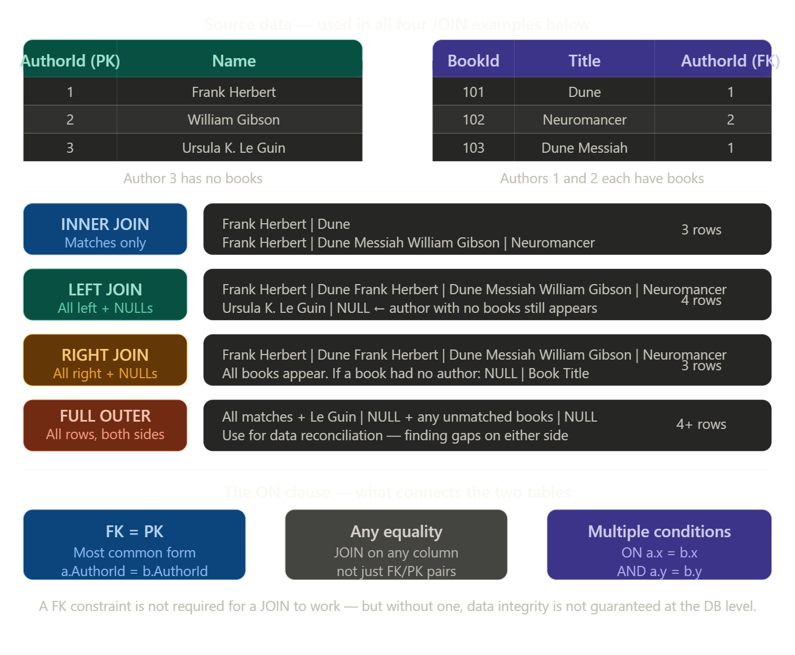
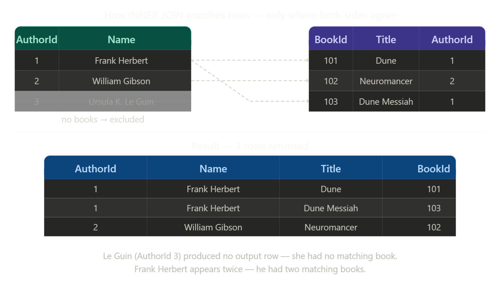
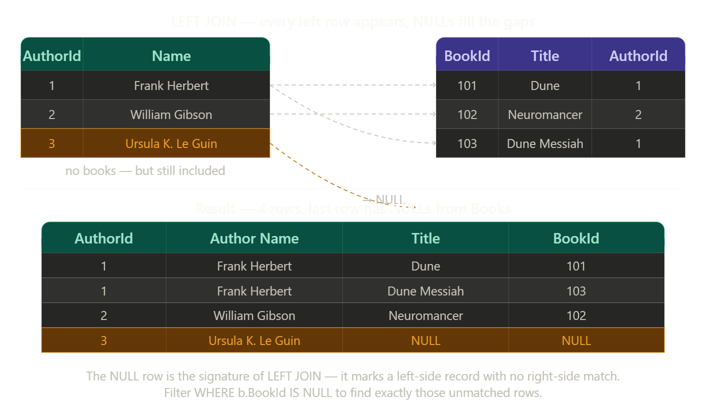
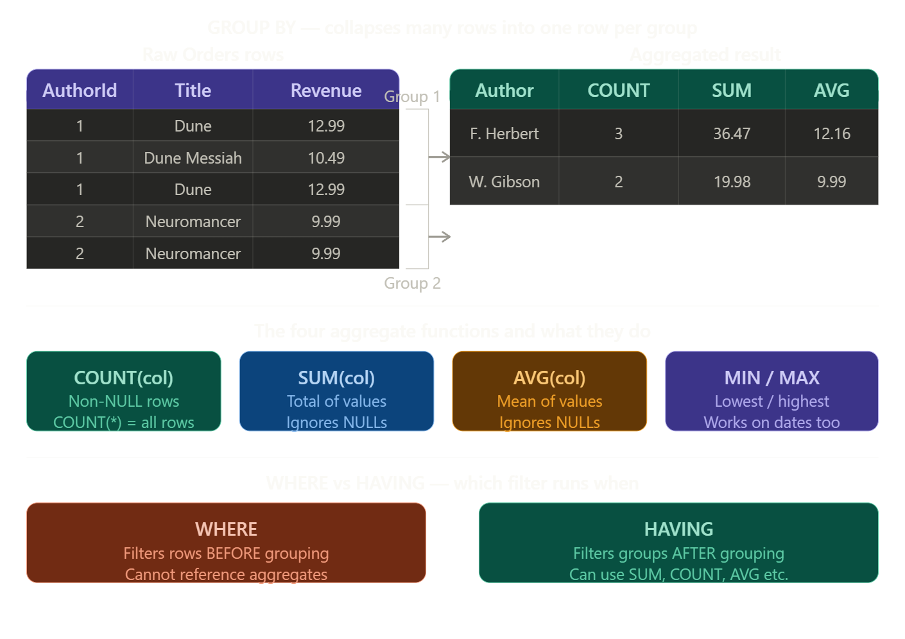
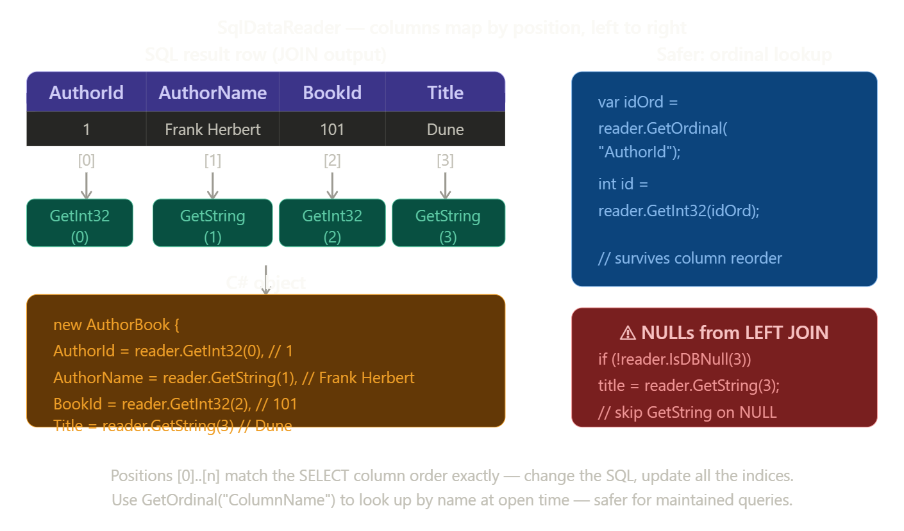
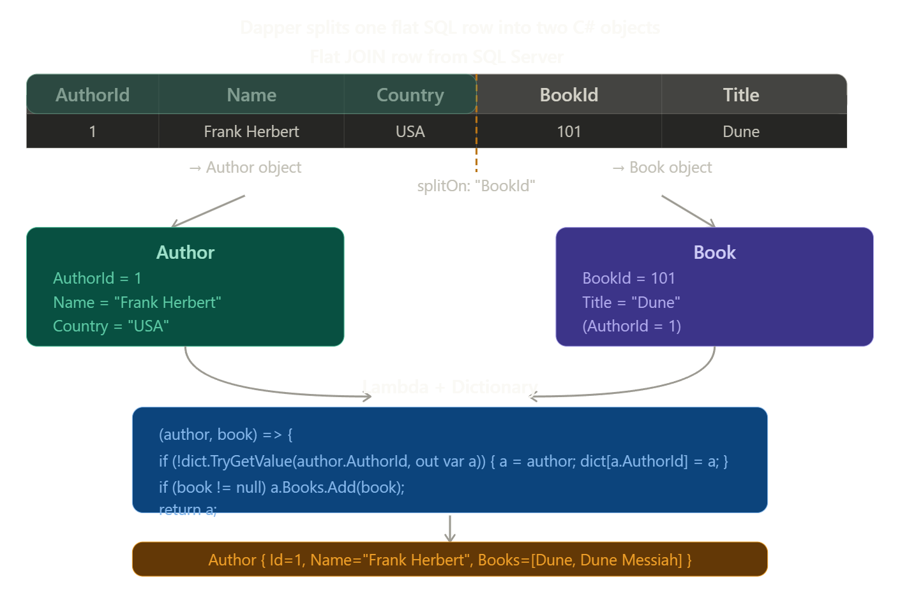
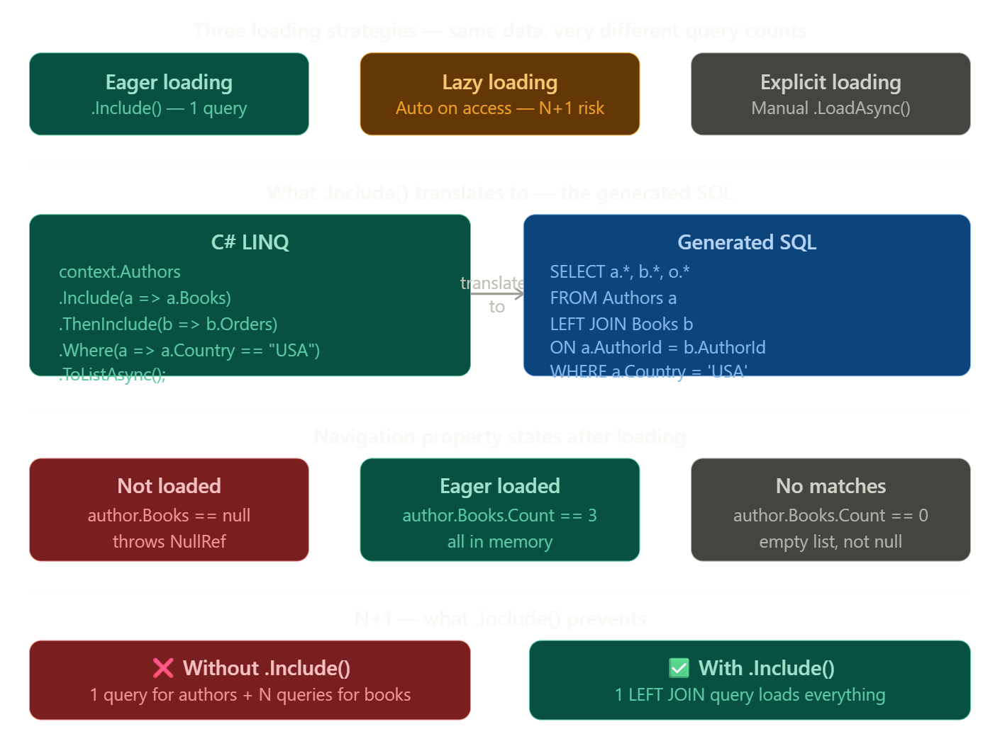
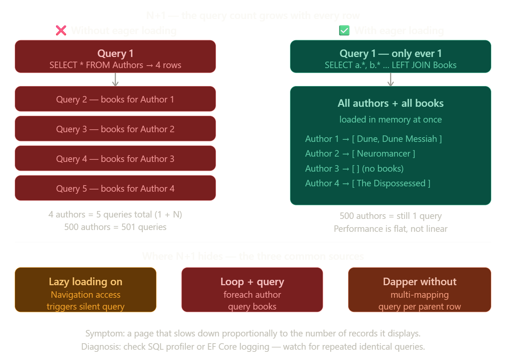

# Grokking Relational Database Design: Chapter 2 Masterclass

## Related Tables, JOINs, and .NET Data Shaping

### 1. CHAPTER OVERVIEW & LEARNING OBJECTIVES

### Chapter Summary

Chapter 2 transitions from isolated tables to a true relational ecosystem. It introduces the Foreign Key, the mechanism that links tables together, enforcing "Referential Integrity." With data now spread across multiple tables to reduce redundancy, the chapter covers advanced SQL—specifically `JOIN` operations and aggregations (`GROUP BY`)—to stitch that data back together into meaningful business information. In .NET, this chapter is critical because object-oriented programming naturally relies on nested object graphs (e.g., a `Customer` object containing a list of `Order` objects), and you must know how to shape relational data to fit those models.

### Learning Objectives

By the end of this chapter, you will be able to:

1. **Define and implement** Foreign Keys to establish relationships between tables.
2. **Explain and enforce** Referential Integrity to prevent orphaned records.
3. **Write** queries utilizing `INNER JOIN`, `LEFT JOIN`, and `RIGHT JOIN` to combine data.
4. **Aggregate** data using `GROUP BY` and functions like `SUM()`, `COUNT()`, and `AVG()`.
5. **Map** joined SQL results into nested C# object graphs using **Dapper** and **Entity Framework Core**.
6. **Solve** the "N+1 Query Problem" in .NET applications.

### Setting the Stage

Chapter 1 gave us buckets (tables). Chapter 2 gives us the pipes (relationships) connecting those buckets. This sets the stage for Chapter 3's design principles, as you cannot design a database without understanding how tables interact.

### The Key Problem Solved

_"How do we store data efficiently without duplication, yet retrieve it as a single, unified view for the application layer?"_

## 2. CONCEPT BREAKDOWN WITH VISUAL DIAGRAMS

### Concept 1: The Foreign Key & Referential Integrity

- **ELI5**: Imagine a library book that has a "Checked Out By" card. The card just has a Member ID on it. That ID is a Foreign Key. It only works if that Member ID actually exists in the library's main system (Referential Integrity).

- **Technical**: A Foreign Key (FK) is a column or group of columns in one table that uniquely identifies a row of another table (usually pointing to its Primary Key). Referential integrity ensures that you cannot insert an FK value that doesn't exist in the parent table, and you cannot delete a parent record if child records still reference it.

### Concept 2: SQL JOINs

- **Definition**: A set operation that combines columns from one or more tables into a new result set based on a related column between them.

- **Types**:
  - `INNER JOIN`: Returns records that have matching values in both tables.
  - `LEFT JOIN`: Returns all records from the left table, and the matched records from the right table (or NULLs if no match).

## Visual Diagrams

### Diagram A: Referential Integrity (ASCII Art)

```
Table: Users (Parent)                 Table: Orders (Child)
+--------+-----------+                +---------+------------+----------+
| UserId | Name      |                | OrderId | OrderTotal | UserId   |
| (PK)   |           |                | (PK)    |            | (FK)     |
+--------+-----------+                +---------+------------+----------+
| 1      | Alice     | <------------+ | 101     | $50.00     | 1        |
| 2      | Bob       | <-+          | | 102     | $12.50     | 2        |
| 3      | Charlie   |   +----------+-| 103     | $99.99     | 2        |
+--------+-----------+                | 104     | $5.00      | 99 (❌)  |
                                      +---------+------------+----------+
                                       ^ ERROR: Referential Integrity Violation!
                                         User 99 does not exist. The DB rejects this.
```

### Diagram B: INNER vs LEFT JOIN (Venn Diagrams)

```
      INNER JOIN                      LEFT JOIN
      (Intersection)                  (All Left + Intersection)
       ___       ___                   ___       ___
      /   \     /   \                 /|||\     /   \
     /  A  \___/  B  \               /|||||\___/  B  \
    |      |XXX|      |             ||||||||XXX|      |
     \     /^^^\     /               \|||||/^^^\     /
      \___/     \___/                 \|||/     \___/

  Only returns data where         Returns ALL of A. If B has no
  FK matches PK perfectly.        match, B's columns return NULL.
```

## 3. COMPREHENSIVE CODE EXAMPLES

### Level 1 - Basic Example (Raw ADO.NET with INNER JOIN)

Demonstrating how to flatten joined relational data into a simple string output.

```cs
using Microsoft.Data.SqlClient;

public class JoinDemo
{
    public static void FetchUserOrders(string connectionString)
    {
        // SQL JOIN: Stitches Users and Orders together
        const string sql = """
            SELECT u.Name, o.OrderTotal
            FROM Users u
            INNER JOIN Orders o ON u.UserId = o.UserId
            WHERE u.UserId = @UserId
            """;

        using SqlConnection conn = new(connectionString);
        using SqlCommand cmd = new(sql, conn);
        cmd.Parameters.AddWithValue("@UserId", 2); // Bob

        conn.Open();
        using SqlDataReader reader = cmd.ExecuteReader();

        Console.WriteLine("Bob's Orders:");
        while (reader.Read())
        {
            // Flat reading of joined data
            string name = reader.GetString(0);
            decimal total = reader.GetDecimal(1);
            Console.WriteLine($"{name} ordered: ${total}");
        }
    }
}
```

### Level 2 - Realistic Example (Dapper Multi-Mapping)

In .NET, we don't want flat data; we want object graphs. Here, Dapper maps an `INNER JOIN` into a nested C# object.

```cs
using Dapper;
using Microsoft.Data.SqlClient;

// 1. C# Object Graph
public class User
{
  public int UserId { get; set; }
  public string Name { get; set; } = "";
  public List<Order> Orders { get; set; } = []; // Nested collection
}

public class Order
{
  public int OrderId { get; set; }
  public decimal OrderTotal { get; set; }
}

public class OrderRepository(string connectionString)
{
  public async Task<User?> GetUserWithOrdersAsync(int userId)
  {
    const string sql = """
        SELECT u.UserId, u.Name, o.OrderId, o.OrderTotal
        FROM Users u
        LEFT JOIN Orders o ON u.UserId = o.UserId
        WHERE u.UserId = @Id
        """;

    await using SqlConnection conn = new(connectionString);

    var userDictionary = new Dictionary<int, User>();

    // Dapper Multi-Mapping: Maps the joined row to User and Order objects
    await conn.QueryAsync<User, Order, User>(
      sql,
      (user, order) =>
      {
        if (!userDictionary.TryGetValue(user.UserId, out var currentUser))
        {
          currentUser = user;
          userDictionary.Add(currentUser.UserId, currentUser);
        }

        if (order != null)
          currentUser.Orders.Add(order);

        return currentUser;
      },
      new { Id = userId },
      splitOn: "OrderId" // Tells Dapper where the Order object begins in the SQL columns
    );

    return userDictionary.Values.FirstOrDefault();
  }
}
```

## Level 3 - Advanced Example (EF Core Navigation Properties)

### Entity Framework Core handles the JOINs for you using LINQ and `.Include()`.

```cs
using Microsoft.EntityFrameworkCore;

// 1. Entities with Navigation Properties
public class Customer
{
  public int Id { get; set; }
  public required string Name { get; set; }

  // Navigation Property indicating a 1-to-Many relationship
  public ICollection<Invoice> Invoices { get; set; } = new List<Invoice>();
}

public class Invoice
{
  public int Id { get; set; }
  public decimal Amount { get; set; }

  // Foreign Key backing field
  public int CustomerId { get; set; }
  // Navigation Property pointing back to parent
  public Customer Customer { get; set; } = null!;
}

// 2. The Service Layer
public class CustomerService(DbContext context)
{
  public async Task<List<Customer>> GetHighValueCustomersAsync()
  {
    // ❌ THE N+1 PROBLEM (Anti-pattern):
    // var customers = await context.Customers.ToListAsync();
    // foreach(var c in customers) { var inv = context.Invoices.Where(i => i.CustomerId == c.Id).ToList(); }
    // Result: 1 query for customers, N queries for invoices. Kills performance.

    // ✅ THE RIGHT WAY: Eager Loading with .Include()
    // EF Core translates this into a single LEFT JOIN in SQL.
    return await context.Customers
      .Include(c => c.Invoices) // Triggers the SQL JOIN
      .Where(c => c.Invoices.Sum(i => i.Amount) > 1000m) // SQL GROUP BY / HAVING translation
      .ToListAsync();
  }
}
```

## 4. HANDS-ON CODING EXERCISES

### Exercise 1: The Matchmaker (SQL JOINs)

**Difficulty**: Intermediate
**Time Estimate**: 20 minutes
**Objective**: Write a query that combines `Departments` and `Employees`.

**Requirements**:

1. Return Department Name, Employee Name, and Salary.
2. Include ALL departments, even if they have 0 employees (Hint: use `LEFT JOIN`).
3. Order the results by Department Name alphabetically.

### Exercise 2: EF Core Relationship Builder

**Difficulty**: Advanced
**Time Estimate**: 30 minutes
**Objective**: Configure a 1-to-Many relationship in C# using EF Core Fluent API.
**Requirements**: Create an `Author` and `Book` class. Use the `OnModelCreating` method in your `DbContext` to explicitly configure the `AuthorId` as a Foreign Key that `Cascade Deletes` (if an author is deleted, delete their books).

## 5. REAL-WORLD SCENARIOS & CASE STUDIES

### Scenario: The Orphaned Cart Problem

**Before**: An e-commerce startup built their database without Foreign Keys "to save time." A bug allowed administrators to delete products from the `Products` table. However, thousands of users still had those `ProductIds` in their `ShoppingCartItems` table. When the app tried to render the cart, it crashed with `NullReferenceExceptions` because the product data was gone.
**After (Applying Chapter 2)**: They added a Foreign Key constraint: `ALTER TABLE ShoppingCartItems ADD CONSTRAINT FK_Cart_Product FOREIGN KEY (ProductId) REFERENCES Products(Id)`.

- **Result**: Now, if an admin tries to delete a product that is in someone's cart, SQL Server throws an exception, blocking the deletion and preventing app crashes. Data integrity is preserved at the lowest level.

## 6. CONCEPT CONNECTIONS & RELATIONSHIPS

### Concept Map:

```
[Chapter 1: Primary Keys]
          |
          v
(Referenced by)
          |
[Chapter 2: Foreign Keys] ---> forces ---> [Referential Integrity]
          |                                        |
          v                                        v
[SQL JOINs] <--------- maps to --------> [.NET Navigation Properties]
```

## 7. DEEP DIVE SECTIONS

### Under the Hood: Indexes on Foreign Keys

By default, SQL Server automatically creates an index on Primary Keys (to enforce uniqueness and speed up lookups). **It does NOT automatically index Foreign Keys**. When you execute an `INNER JOIN Orders ON Users.Id = Orders.UserId`, SQL Server has to scan the `Orders` table to find the matching `UserId`. If Orders has 10 million rows, this is painfully slow.

- **Pro-Tip**: In production .NET apps, _always_ create an index on your Foreign Key columns. EF Core does this automatically for you, which is one of its hidden benefits!

## 8. INTERACTIVE LEARNING ACTIVITIES

### Code Analysis Challenge

**Identify the issue**:

```sql
SELECT c.CategoryName, COUNT(p.ProductId)
FROM Categories c
INNER JOIN Products p ON c.CategoryId = p.CategoryId
```

- **Issues to identify**:

1. Missing `GROUP BY`. You cannot select a raw column (`CategoryName`) alongside an aggregate function (`COUNT`) without grouping by that raw column.
2. If a Category has 0 products, it won't show up. It should be a `LEFT JOIN`.

## 9. KNOWLEDGE VALIDATION

### Conceptual Questions

- **Q**: Can a Foreign Key reference a column that is not a Primary Key?
  - **A**: Yes, but it MUST reference a column with a `UNIQUE` constraint. It must point to a guaranteed unique value.

- **Q**: What is the "N+1 Problem" in ORMs?
  - **A**: It's when an ORM executes 1 query to get a list of parent records, and then N additional queries to get the child records for each parent, instead of using a single `JOIN`.

## 10. SUPPLEMENTARY RESOURCES

- **Microsoft Docs**: [Loading Related Data in EF Core](https://learn.microsoft.com/en-us/ef/core/querying/related-data/)
- **Video**: Search YouTube for "Dapper Multi-Mapping Tutorial .NET 8".

## 11. STUDY STRATEGIES FOR THIS CHAPTER

- **Mental Model**: Think of `INNER JOIN` as a strict bouncer. Both tables must be on the list. Think of `LEFT JOIN` as a VIP host; the left table gets in no matter what, and the right table comes along if they are attached.
- **Practice**: Don't just read JOINs. Draw two circles on paper, put numbers in them, and manually calculate the result set.

## 12. PRACTICAL PROJECT: CHAPTER 2 CAPSTONE

### Project: The Blog Engine

1. **SQL Phase**: Create `Authors` (Id, Name) and `Posts` (Id, Title, Content, AuthorId). Add a Foreign Key constraint.

2. **C# Phase**: Write an API endpoint that returns a list of Authors, and nested inside each author, an array of their Posts. Use EF Core `.Include()` to do this in a single query.

3. **Validation**: Try to insert a `Post` with an `AuthorId` of `9999`. Ensure SQL throws a referential integrity error.

## 13. TROUBLESHOOTING & FAQ

- **Q: Why are my `LEFT JOIN` columns coming back null in C#?**
  - **A**: Because the right side of the join had no match! In C#, ensure properties mapping to the right side of a `LEFT JOIN` are nullable (e.g., `int?` instead of `int`).

- **Q: EF Core is giving me a tracking loop error when I serialize to JSON.**
  - **A**: When `User` includes `Order`, and `Order` includes `User`, JSON serializers get stuck in an infinite loop. Use `[JsonIgnore]` on the child's parent reference, or map to a DTO (Data Transfer Object).

# Summary


### Here's how to read the diagram top to bottom:

**Chapter 2's central thesis** — normalized data splits facts across multiple tables to eliminate duplication. The two mechanisms that make this work are the Foreign Key (how tables link) and SQL JOINs (how you query across those links). The dashed line between them shows they're two sides of the same coin.

**Left column** traces the data integrity story: a Foreign Key enforces Referential Integrity — you can't insert an order for a customer that doesn't exist. Cascade Behavior then defines what happens when a parent row is deleted or updated (`ON DELETE CASCADE`, `ON DELETE RESTRICT`, etc.).

**Right column** traces the querying story: SQL JOINs split into the two types covered in the chapter — Inner Join returns only rows where both sides match, Left Join returns everything from the left table and nulls where the right has no match. GROUP BY then sits below both because aggregation (`SUM`, `COUNT`, `AVG`) almost always operates on joined data.

**Both columns converge** into the .NET integration layer, which mirrors Chapter 1's structure — three tiers of abstraction for the same job: ADO.NET reads flat joined rows manually, Dapper's multi-mapping assembles them into nested C# objects, and EF Core's `.Include()` handles the JOIN entirely from C#.

**The N+1 warning** sits at the very bottom as a consequence of getting the .NET layer wrong — it's the most common performance mistake when moving from flat tables to object graphs.

## 1. Chapter 2 (Related Tables)


Normalization is the process of restructuring a database to reduce redundancy and prevent data anomalies. The core idea is simple: **every fact should be stored exactly once**. When a fact lives in multiple places, the database can become inconsistent — updating a price in one row but not another, for example. Splitting data into focused tables connected by foreign keys is how you achieve that.

---

### The problem with one big table

The diagram's "before" table shows the classic symptom: Alice's name and email appear on rows 1 and 2 because she placed two orders. Dune's price of 12.99 appears on rows 1 and 3 because two customers bought it. This redundancy creates three types of anomaly:

- **Update anomaly** — if Dune's price changes to 14.99, you must update every row that mentions Dune. Miss one and the database now holds two different prices for the same product.
- **Insert anomaly** — you can't record a new product until someone actually orders it, because there's no order row to put it in.
- **Delete anomaly** — if Bob cancels his only order, you lose the fact that Dune costs 12.99 entirely, because that knowledge was only stored alongside the order.

---

### The solution — three focused tables

The "after" state stores each fact once: Alice's email lives only in `Customers`, Dune's price lives only in `Products`, and `Orders` contains only the relationship between them — two foreign keys pointing at the relevant customer and product rows. To answer "what did Alice order and at what price?", you use a `JOIN` to reassemble the data at query time.

---

### The three normal forms

Normalization is typically taught as a progression of rules, each eliminating a different class of redundancy. The bottom row of the diagram shows them as a chain — each builds on the previous.

**1NF — atomic values, no repeating groups.** Every cell must hold a single value. A column like `"Dune, Neuromancer, The Martian"` in one cell violates 1NF. Each value gets its own row.

**2NF — no partial dependencies.** Every non-key column must depend on the _whole_ primary key, not just part of it. This mainly matters when a table has a composite primary key. If a table has `(OrderId, ProductId)` as a PK but stores `ProductName` — which only depends on `ProductId`, not the full key — that's a partial dependency. `ProductName` belongs in `Products`.

**3NF — no transitive dependencies.** Every non-key column must depend _directly_ on the primary key, not on another non-key column. If an `Orders` table stored both `CustomerId` and `CustomerEmail`, the email depends on the customer — not the order. It belongs in `Customers`.

---

### The trade-off normalization introduces

The cost of normalization is that data you once read in a single table scan now requires a `JOIN`. This is exactly why Chapter 2 covers `JOIN`s immediately after introducing foreign keys — normalization and `JOIN`s are inseparable. You normalize to write data cleanly, you `JOIN` to read it back together.

## 1.1 Foreign Key (References a PK in another table)


A foreign key is a column in one table whose value must match an existing primary key value in another table. It is the physical mechanism that enforces the relationship between two tables — the "pipe" that connects them.

---

### The three ways to declare a FK

**Option 1 — inline, at table creation (simplest)**

```sql
CREATE TABLE Orders (
    OrderId INT IDENTITY(1,1) PRIMARY KEY,
    Total DECIMAL(10,2) NOT NULL,
    CustomerId INT NOT NULL
      REFERENCES Customers(CustomerId)   -- FK declared inline
);
```

**Option 2 — named constraint block (recommended for production)**

Naming the constraint lets you reference it later in `ALTER` or error messages:

```sql
CREATE TABLE Orders (
    OrderId INT IDENTITY(1,1) PRIMARY KEY,
    Total DECIMAL(10,2) NOT NULL,
    CustomerId INT NOT NULL,

    CONSTRAINT FK_Orders_Customers
      FOREIGN KEY (CustomerId)
      REFERENCES Customers(CustomerId)
      ON DELETE NO ACTION
      ON UPDATE CASCADE
);
```

**Option 3 — alter an existing table (when the table already exists)**

```sql
ALTER TABLE Orders
ADD CONSTRAINT FK_Orders_Customers
  FOREIGN KEY (CustomerId)
  REFERENCES Customers(CustomerId);
```

---

### What referential integrity actually enforces

With the FK in place, SQL Server enforces two rules automatically with no extra code:

```sql
-- ✅ Allowed — CustomerId 1 (Alice) exists
INSERT INTO Orders (Total, CustomerId) VALUES (50.00, 1);

-- ❌ Blocked — CustomerId 99 does not exist in Customers
INSERT INTO Orders (Total, CustomerId) VALUES (5.00, 99);
-- Msg 547: The INSERT statement conflicted with the FOREIGN KEY constraint

-- ❌ Blocked — Bob has orders, can't delete him without resolving them first
DELETE FROM Customers WHERE CustomerId = 2;
-- Msg 547: The DELETE statement conflicted with the REFERENCE constraint
```

---

### Choosing the right cascade behaviour

The cascade option controls what happens to child rows when the parent is deleted or updated:

| Option        | What happens to Orders when a Customer is deleted |
| ------------- | ------------------------------------------------- |
| `NO ACTION`   | Blocks the delete — SQL Server default, safest    |
| `CASCADE`     | Deletes all the customer's orders automatically   |
| `SET NULL`    | Sets `CustomerId` to NULL on orphaned orders      |
| `SET DEFAULT` | Resets `CustomerId` to the column's default value |

`NO ACTION` is the right default for most production scenarios — it forces you to consciously handle the child data before removing a parent. `CASCADE` is appropriate for data that has no meaning without its parent, such as order line items belonging to an order.

---

### The FK index you must add manually

SQL Server creates an index on primary keys automatically. It does **not** create one on foreign key columns. Every `JOIN` on `Orders.CustomerId` without an index causes a full table scan:

```sql
-- Always add this after creating the FK
CREATE INDEX IX_Orders_CustomerId
ON Orders (CustomerId);
```

EF Core does this for you silently — one of its practical advantages over writing DDL by hand.

## 1.1.1 Referential Integrity (No isolated FK records allowed)


Referential integrity is the guarantee that **every foreign key value in a child table points to a real, existing row in the parent table**. SQL Server enforces it automatically the moment a `FOREIGN KEY` constraint exists — no application code required.

It collapses into two rules, shown in the diagram's two scenarios:

---

### Rule 1 — you cannot insert a child row with a non-existent FK value

```sql
-- ProductId 99 doesn't exist in Products
INSERT INTO CartItems (UserId, ProductId)
VALUES (42, 99);

-- SQL Server response:
-- Msg 547: The INSERT statement conflicted with the
-- FOREIGN KEY constraint "FK_CartItems_Products".
```

The database engine checks the parent table _before_ writing the row. If the FK value isn't found, the insert is rejected entirely — the row never reaches disk.

---

### Rule 2 — you cannot delete a parent row while children still reference it

```sql
-- Author 7 (Frank Herbert) still has books in the Books table
DELETE FROM Authors WHERE AuthorId = 7;

-- SQL Server response:
-- Msg 547: The DELETE statement conflicted with the
-- REFERENCE constraint "FK_Books_Authors".
```

To delete the author you must first either delete their books, reassign them to another author, or configure `ON DELETE CASCADE` to do it automatically. The database will not leave orphaned book rows behind.

---

### Why enforcement must live in the database, not the application

This is the critical architectural point. Consider what happens without a FK constraint:

```csharp
// Your .NET service validates before deleting
public async Task DeleteProductAsync(int productId)
{
  bool hasCartItems = await context.CartItems
    .AnyAsync(c => c.ProductId == productId);

  if (hasCartItems) throw new InvalidOperationException("Product is in a cart.");

  context.Products.Remove(product);
  await context.SaveChangesAsync();
}
```

This looks safe, but it has a race condition — two requests could check `AnyAsync` simultaneously, both see no cart items, and both proceed to delete. More critically, **any other SQL client** — a migration script, a reporting tool, a developer running a query manually — can bypass your C# validation entirely and delete the row directly.

A FK constraint has no such weakness. It operates at the storage engine level, below every application layer, enforced on every connection regardless of what wrote the SQL.

---

### What referential integrity prevents in the real world

The chapter's e-commerce scenario is the clearest example: without a FK between `ShoppingCartItems.ProductId` and `Products.ProductId`, deleting a product leaves cart rows pointing at nothing. When the app later tries to render the cart and joins to `Products`, those rows return `NULL` — causing `NullReferenceException` in .NET code that wasn't written to handle missing products.

The fix is one `ALTER TABLE` statement. After that, SQL Server blocks the problematic delete at the source and the bug becomes impossible.

## Cascade Behavior (ON DELETE / ON UPDATE rule)


`ON DELETE CASCADE` and `ON UPDATE CASCADE` are rules attached to a foreign key constraint that tell SQL Server what to do automatically to child rows when the parent row is deleted or its primary key is updated. Without them, both operations are blocked by default.

---

### The syntax

```sql
CREATE TABLE Books (
    BookId INT IDENTITY(1,1) PRIMARY KEY,
    Title VARCHAR(255) NOT NULL,
    AuthorId INT NULL,

    CONSTRAINT FK_Books_Authors
      FOREIGN KEY (AuthorId)
      REFERENCES Authors(AuthorId)
      ON DELETE CASCADE      -- delete the book if author is deleted
      ON UPDATE CASCADE      -- update AuthorId if author's PK changes
);
```

You can mix the two independently — `ON DELETE CASCADE` with `ON UPDATE NO ACTION` is a common combination.

---

### ON DELETE CASCADE — what it actually does

```sql
-- This single statement...
DELETE FROM Authors WHERE AuthorId = 7;

-- ...automatically also runs:
-- DELETE FROM Books WHERE AuthorId = 7
-- behind the scenes, in the same transaction.
```

The cascade fires inside the same atomic transaction. If the child delete fails for any reason, the parent delete is rolled back too. Nothing is left in a half-deleted state.

---

### ON UPDATE CASCADE — rarer but useful

```sql
-- If you reassign an author's ID (unusual but possible)
UPDATE Authors SET AuthorId = 99 WHERE AuthorId = 7;

-- All Books rows with AuthorId = 7 automatically become AuthorId = 99
```

In practice, `ON UPDATE CASCADE` matters most when the parent table's PK is a natural key (like an ISBN or a country code) rather than a surrogate integer — those are the values that occasionally need to change.

---

### Choosing the right option for real scenarios

**Use `CASCADE`** when the child data has no independent meaning without the parent. Order line items without an order, comments without a post, addresses belonging exclusively to a deleted user — these are all good cascade candidates. Deleting the parent should logically destroy the children.

**Use `SET NULL`** when the relationship is optional. A book might have an assigned editor, but if that editor account is deleted the book itself should survive — just unassigned. The FK column must be nullable (`INT NULL`) for this to work.

**Use `NO ACTION` (the default)** for most production tables. It forces your application or migration script to explicitly handle children before the parent can be removed. This is the safest option because it makes the dependency visible and intentional rather than silent.

**Avoid `CASCADE` on wide chains.** If `Authors` cascades to `Books`, and `Books` cascades to `Reviews`, deleting one author silently deletes every book and every review. In a large schema this becomes very hard to reason about, and SQL Server will reject circular cascade paths entirely with a schema error.

---

### EF Core configuration

```csharp
modelBuilder.Entity<Book>()
  .HasOne(b => b.Author)
  .WithMany(a => a.Books)
  .HasForeignKey(b => b.AuthorId)
  .OnDelete(DeleteBehavior.Cascade);  // maps to ON DELETE CASCADE
```

EF Core's `DeleteBehavior` enum maps directly to the SQL Server options: `Cascade`, `SetNull`, `Restrict` (equivalent to `NO ACTION`), and `ClientSetNull` (handled in memory rather than by the DB engine).

## 1.2 SQL JOINs (Recombining Normalized Data)



A JOIN combines columns from two tables into a single result set based on a related column — almost always a foreign key matching a primary key. The type of JOIN controls what happens to rows that have _no match_ on the other side.

---

### INNER JOIN — only matched rows

```sql
SELECT a.Name, b.Title
FROM Authors a
INNER JOIN Books b ON a.AuthorId = b.AuthorId;
```

Returns only rows where both sides have a match. Le Guin disappears from the result entirely because she has no books. This is the right choice when you only care about complete data — every row in the result is guaranteed to have values from both tables.

---

### LEFT JOIN — all left rows, NULLs where no match

```sql
SELECT a.Name, b.Title
FROM Authors a
LEFT JOIN Books b ON a.AuthorId = b.AuthorId;
```

Returns every row from `Authors` regardless of whether they have a book. Le Guin appears with `NULL` in the `Title` column. This is the join to reach for when you want to find or include records that _don't_ have related data — "show me all authors, and their books if they have any."

The chapter's exercise specifically requires a `LEFT JOIN` to include departments with zero employees — `INNER JOIN` would silently drop those departments from the result.

---

### RIGHT JOIN — all right rows, NULLs where no match

```sql
SELECT a.Name, b.Title
FROM Authors a
RIGHT JOIN Books b ON a.AuthorId = b.AuthorId;
```

The mirror of `LEFT JOIN` — every `Books` row appears, even if no matching author exists. In practice, most developers rewrite `RIGHT JOIN` as a `LEFT JOIN` with the tables swapped, since the left-to-right reading direction is more natural.

---

### FULL OUTER JOIN — everything from both sides

```sql
SELECT a.Name, b.Title
FROM Authors a
FULL OUTER JOIN Books b ON a.AuthorId = b.AuthorId;
```

Returns all rows from both tables, with `NULL` filling in wherever a match is absent. Primarily used for data reconciliation — finding gaps on either side, like authors with no books _and_ books with no author in the same query.

---

### The ON clause

The `ON` clause defines the join condition. It is almost always a FK/PK equality, but it can be any boolean expression:

```sql
-- Standard FK = PK
INNER JOIN Books b ON a.AuthorId = b.AuthorId

-- Multiple conditions (composite key)
INNER JOIN OrderItems oi ON o.OrderId = oi.OrderId
                        AND o.StoreId = oi.StoreId

-- Non-key join (date range overlap)
LEFT JOIN Promotions p ON p.StartDate <= o.OrderDate
                      AND p.EndDate   >= o.OrderDate
```

A FK constraint is not _required_ for a JOIN to execute — SQL Server will join any two columns you tell it to. The FK just guarantees that the values being joined are trustworthy.

---

### How JOINs map to .NET

Each JOIN type has a direct equivalent in EF Core LINQ:

```csharp
// INNER JOIN — use .Include() or explicit join
var books = await context.Books
  .Include(b => b.Author)   // INNER JOIN by default when Author is required
  .ToListAsync();

// LEFT JOIN — use .Include() on optional navigation property
var authors = await context.Authors
  .Include(a => a.Books)    // LEFT JOIN — authors with no books get empty list
  .ToListAsync();
```

In Dapper, you write the SQL JOIN directly and use multi-mapping (`splitOn`) to assemble the nested object graph — the `QueryAsync<Author, Book, Author>` pattern covered in the chapter.

## 1.2.1 INNER JOIN (Matches Only)



The diagram shows the core mechanic: SQL Server compares every `Authors.AuthorId` against every `Books.AuthorId`. Only rows where both values match make it into the result. Le Guin has no matching book row, so she's excluded entirely.

---

### Scenario — a bookshop reporting dashboard

The schema we'll work with throughout:

```sql
CREATE TABLE Authors (
  AuthorId INT IDENTITY(1,1) PRIMARY KEY,
  Name VARCHAR(150) NOT NULL,
  Country VARCHAR(80) NOT NULL
);

CREATE TABLE Books (
    BookId INT IDENTITY(1,1) PRIMARY KEY,
    Title VARCHAR(255) NOT NULL,
    Price DECIMAL(10,2) NOT NULL,
    AuthorId INT NOT NULL,
    CONSTRAINT FK_Books_Authors
      FOREIGN KEY (AuthorId) REFERENCES Authors(AuthorId)
);

CREATE TABLE Orders (
  OrderId INT IDENTITY(1,1) PRIMARY KEY,
  OrderDate DATE NOT NULL,
  BookId INT NOT NULL,
  Quantity INT NOT NULL,
  CONSTRAINT FK_Orders_Books
    FOREIGN KEY (BookId) REFERENCES Books(BookId)
);
```

---

### Example 1 — two-table join: every book with its author

```sql
SELECT
  a.Name AS Author,
  b.Title AS Book,
  b.Price
FROM Authors a
INNER JOIN Books b ON a.AuthorId = b.AuthorId
ORDER BY a.Name, b.Title;
```

The table aliases (`a`, `b`) are just shorthand — required here because both tables have an `AuthorId` column and SQL needs to know which one you mean in the `ON` clause.

---

### Example 2 — three-table join: orders with book and author details

```sql
SELECT
  o.OrderId,
  o.OrderDate,
  b.Title AS BookTitle,
  a.Name AS Author,
  o.Quantity,
  b.Price * o.Quantity AS LineTotal
FROM Orders o
INNER JOIN Books b ON o.BookId = b.BookId
INNER JOIN Authors a ON b.AuthorId = a.AuthorId
WHERE o.OrderDate >= '2024-01-01'
ORDER BY o.OrderDate DESC;
```

Each `INNER JOIN` adds one table to the result. The join chain flows naturally through the foreign keys: `Orders → Books → Authors`. You can keep adding tables this way as long as each new table has a column that relates to one already in the query.

---

### Example 3 — filtering on a joined column

```sql
-- Only books by authors from the USA
SELECT b.Title, b.Price, a.Name AS Author
FROM Books b
INNER JOIN Authors a ON b.AuthorId = a.AuthorId
WHERE a.Country = 'USA'
ORDER BY b.Price DESC;
```

`WHERE` filters are applied _after_ the join. Here the join produces a combined row for every book/author pair, then the `WHERE` clause trims it to only USA authors. This is a key pattern — joining first gives you access to columns from both tables inside the `WHERE`.

---

### Example 4 — aggregation on joined data

```sql
-- Total revenue per author
SELECT
  a.Name AS Author,
  COUNT(o.OrderId) AS TotalOrders,
  SUM(b.Price * o.Quantity) AS TotalRevenue
FROM Authors a
INNER JOIN Books  b ON a.AuthorId = b.AuthorId
INNER JOIN Orders o ON b.BookId   = o.BookId
GROUP BY a.AuthorId, a.Name
ORDER BY TotalRevenue DESC;
```

`GROUP BY` collapses the joined rows into one row per author, then `SUM` and `COUNT` aggregate across all their orders. The `GROUP BY` must list every non-aggregated column in the `SELECT` — here that's `a.AuthorId` and `a.Name`.

---

### In Dapper

```csharp
const string sql = """
  SELECT a.AuthorId, a.Name, b.BookId, b.Title, b.Price
  FROM Authors a
  INNER JOIN Books b ON a.AuthorId = b.AuthorId
  ORDER BY a.Name
  """;

var authorDict = new Dictionary<int, Author>();

await conn.QueryAsync<Author, Book, Author>(sql,
  (author, book) => {
    if (!authorDict.TryGetValue(author.AuthorId, out var current)) {
      current = author;
      authorDict[author.AuthorId] = current;
    }
    current.Books.Add(book);
    return current;
  },
  splitOn: "BookId"   // tells Dapper where the Book object starts in the columns
);

var authors = authorDict.Values.ToList();
```

The `splitOn` parameter is the column name where Dapper stops reading into the first type and starts reading into the second. It must match the first column of the second type in your `SELECT` list.

## 1.2.2 LEFT JOIN (Left + nulls)



`LEFT JOIN` guarantees that every row from the left (first) table appears in the result. Where no matching row exists on the right side, SQL Server fills those columns with `NULL`. This makes it the right tool any time you need to _include_ records regardless of whether they have related data.

---

### Example 1 — all authors, with their books if they have any

```sql
SELECT
  a.Name AS Author,
  b.Title AS Book,
  b.Price
FROM Authors a
LEFT JOIN Books b ON a.AuthorId = b.AuthorId
ORDER BY a.Name;
```

Le Guin appears with `NULL` in `Book` and `Price`. With an `INNER JOIN` she would be silently dropped — you'd never know she existed in the result.

---

### Example 2 — the most useful LEFT JOIN pattern: find rows with NO match

Adding `WHERE rightTable.PK IS NULL` turns a `LEFT JOIN` into a gap finder. It filters the result down to _only_ the unmatched left-side rows.

```sql
-- Find all authors who have published no books
SELECT a.AuthorId, a.Name
FROM Authors a
LEFT JOIN Books b ON a.AuthorId = b.AuthorId
WHERE b.BookId IS NULL;   -- NULL means no book row was found
```

This is far cleaner than a subquery (`WHERE AuthorId NOT IN (SELECT AuthorId FROM Books)`) and performs better at scale. Common real-world uses: customers who have never placed an order, products never added to a cart, employees with no assigned manager.

---

### Example 3 — department headcount including empty departments

This is exactly the chapter's Exercise 1 scenario:

```sql
SELECT
  d.DepartmentName,
  COUNT(e.EmployeeId) AS HeadCount,
  AVG(e.Salary) AS AvgSalary
FROM Departments d
LEFT JOIN Employees e ON d.DepartmentId = e.DepartmentId
GROUP BY d.DepartmentId, d.DepartmentName
ORDER BY d.DepartmentName;
```

An empty department returns `HeadCount = 0` and `AvgSalary = NULL`. With `INNER JOIN`, those departments would vanish from the report entirely — a silent omission that could mislead business decisions.

One subtlety: `COUNT(e.EmployeeId)` counts only non-NULL values, so empty departments correctly return `0`. `COUNT(*)` would return `1` for them because it counts the NULL row itself.

---

### Example 4 — three-table LEFT JOIN chain

```sql
-- All customers, their orders if any, and the book on each order if any
SELECT
  c.Name AS Customer,
  o.OrderDate,
  b.Title AS BookOrdered,
  o.Quantity
FROM Customers c
LEFT JOIN Orders o ON c.CustomerId = o.CustomerId
LEFT JOIN Books b ON o.BookId = b.BookId
ORDER BY c.Name, o.OrderDate;
```

Each `LEFT JOIN` in the chain independently preserves unmatched rows. A customer with no orders gets one row with `NULL` for everything after their name. An order that somehow has no matching book gets a `NULL` title but still appears.

---

## When to use LEFT JOIN vs INNER JOIN

| Situation                                   | Use                                  |
| ------------------------------------------- | ------------------------------------ |
| You only want complete, matched data        | `INNER JOIN`                         |
| You need all left rows regardless of match  | `LEFT JOIN`                          |
| Finding records with _no_ related data      | `LEFT JOIN … WHERE right.PK IS NULL` |
| Reporting that must include zero-count rows | `LEFT JOIN` with `COUNT(right.col)`  |
| The relationship is optional (nullable FK)  | `LEFT JOIN`                          |

The general heuristic: if dropping unmatched rows would silently distort the result — missing departments, customers, or products — use `LEFT JOIN`. If a missing match means the row is genuinely meaningless to the query, `INNER JOIN` is cleaner.

---

### In EF Core

EF Core automatically generates a `LEFT JOIN` when you `.Include()` an optional navigation property (a nullable FK):

```csharp
// AuthorId is nullable on Book — EF Core emits LEFT JOIN
var authors = await context.Authors
  .Include(a => a.Books)   // LEFT JOIN Books ON Authors.AuthorId = Books.AuthorId
  .ToListAsync();

// Authors with no books get an empty Books collection, not null
// — EF Core initialises the list for you
```

## 1.2.3 GROUP BY / Aggregate (SUM, COUNT, AVG)



`GROUP BY` works in two phases: first it sorts all matching rows into buckets — one per unique value of the grouping column — then aggregate functions (`SUM`, `COUNT`, `AVG`) collapse each bucket into a single output row.

---

### The golden rule — what you can SELECT with GROUP BY

Every column in your `SELECT` must either be in the `GROUP BY` clause or wrapped in an aggregate function. Raw columns from non-grouped tables are ambiguous — SQL Server doesn't know which row's value to pick.

```sql
-- ❌ Broken — Title is not grouped or aggregated
SELECT AuthorId, Title, COUNT(OrderId)
FROM Orders
GROUP BY AuthorId;

-- ✅ Fixed
SELECT AuthorId, COUNT(OrderId) AS OrderCount
FROM Orders
GROUP BY AuthorId;
```

---

### Example 1 — COUNT: orders per author

```sql
SELECT
  a.Name AS Author,
  COUNT(o.OrderId) AS TotalOrders
FROM Authors a
INNER JOIN Books b ON a.AuthorId = b.AuthorId
INNER JOIN Orders o ON b.BookId = o.BookId
GROUP BY a.AuthorId, a.Name
ORDER BY TotalOrders DESC;
```

`COUNT(o.OrderId)` counts non-NULL values — if a book had no orders the join would exclude it anyway with `INNER JOIN`. Use `COUNT(*)` to count all rows including NULLs, `COUNT(col)` to count only rows where that column has a value.

---

### Example 2 — SUM and AVG: revenue per author

```sql
SELECT
  a.Name AS Author,
  COUNT(o.OrderId) AS TotalOrders,
  SUM(b.Price * o.Quantity) AS TotalRevenue,
  AVG(b.Price * o.Quantity) AS AvgOrderValue,
  MIN(b.Price) AS CheapestBook,
  MAX(b.Price) AS MostExpensiveBook
FROM Authors a
INNER JOIN Books b ON a.AuthorId = b.AuthorId
INNER JOIN Orders o ON b.BookId = o.BookId
GROUP BY a.AuthorId, a.Name
ORDER BY TotalRevenue DESC;
```

Both `SUM` and `AVG` silently ignore `NULL` values. If a price were `NULL`, that row would be excluded from both calculations — which is usually what you want, but worth knowing.

---

### Example 3 — HAVING: filter after grouping

`WHERE` cannot reference aggregate functions — it runs before grouping happens. `HAVING` runs after, which is where you filter on aggregated values.

```sql
-- Only authors whose total revenue exceeds £500
SELECT
  a.Name AS Author,
  SUM(b.Price * o.Quantity) AS TotalRevenue
FROM Authors a
INNER JOIN Books b ON a.AuthorId = b.AuthorId
INNER JOIN Orders o ON b.BookId = o.BookId
GROUP BY a.AuthorId, a.Name
HAVING SUM(b.Price * o.Quantity) > 500
ORDER BY TotalRevenue DESC;
```

`WHERE` and `HAVING` can coexist — `WHERE` trims rows before grouping, `HAVING` trims groups after:

```sql
-- Orders placed in 2024 only, grouped by author, only high-revenue authors
SELECT
  a.Name,
  SUM(b.Price * o.Quantity) AS Revenue
FROM Authors a
INNER JOIN Books b ON a.AuthorId = b.AuthorId
INNER JOIN Orders o ON b.BookId = o.BookId
WHERE o.OrderDate >= '2024-01-01'      -- row filter — runs first
GROUP BY a.AuthorId, a.Name
HAVING SUM(b.Price * o.Quantity) > 200 -- group filter — runs after
ORDER BY Revenue DESC;
```

---

### Example 4 — grouping by multiple columns

```sql
-- Revenue broken down by author AND month
SELECT
  a.Name AS Author,
  FORMAT(o.OrderDate, 'yyyy-MM') AS Month,
  COUNT(o.OrderId) AS Orders,
  SUM(b.Price * o.Quantity) AS Revenue
FROM Authors a
INNER JOIN Books b ON a.AuthorId = b.AuthorId
INNER JOIN Orders o ON b.BookId = o.BookId
GROUP BY a.AuthorId, a.Name, FORMAT(o.OrderDate, 'yyyy-MM')
ORDER BY a.Name, Month;
```

Each unique combination of `(Author, Month)` becomes its own row. The `GROUP BY` list must include `FORMAT(o.OrderDate, 'yyyy-MM')` exactly as it appears in the `SELECT`.

---

### The clause execution order

Understanding this order is what makes `WHERE` vs `HAVING` make sense:

```
FROM   → which tables
JOIN   → combine them
WHERE  → filter individual rows      ← cannot use aggregates here
GROUP BY → bucket the rows
HAVING  → filter the buckets         ← can use aggregates here
SELECT  → compute output columns
ORDER BY → sort the final result
```

This is why `HAVING SUM(...) > 500` works but `WHERE SUM(...) > 500` throws an error — at the point `WHERE` runs, the grouping hasn't happened yet, so there's no `SUM` to evaluate.

## 1.3.1 ADO.NET SqlDataReader in C#



`SqlDataReader` reads the JOIN result as a flat stream of columns — left to right, in whatever order your `SELECT` listed them. Each call to `reader.Read()` advances one row, and you extract each value by position index or by name lookup.

---

### Example 1 — flat JOIN result into a simple record

```csharp
public record AuthorBook(int AuthorId, string AuthorName, int BookId, string Title);

public async Task<List<AuthorBook>> GetAllBooksWithAuthorsAsync()
{
  const string sql = """
      SELECT
          a.AuthorId,
          a.Name       AS AuthorName,
          b.BookId,
          b.Title
      FROM Authors a
      INNER JOIN Books b ON a.AuthorId = b.AuthorId
      ORDER BY a.Name, b.Title
      """;

  await using var conn = new SqlConnection(_connectionString);
  await using var cmd  = new SqlCommand(sql, conn);
  await conn.OpenAsync();

  await using var reader = await cmd.ExecuteReaderAsync();

  var results = new List<AuthorBook>();

  while (await reader.ReadAsync())
  {
    results.Add(new AuthorBook(
      AuthorId:   reader.GetInt32(0),   // a.AuthorId  → position 0
      AuthorName: reader.GetString(1),  // a.Name      → position 1
      BookId:     reader.GetInt32(2),   // b.BookId    → position 2
      Title:      reader.GetString(3)   // b.Title     → position 3
    ));
  }

  return results;
}
```

The positions `0, 1, 2, 3` map exactly to the `SELECT` column order. If you ever reorder the columns in the SQL, every `GetInt32(n)` and `GetString(n)` call must be updated to match — which is the main fragility of raw index access.

---

### Example 2 — safer approach using GetOrdinal

`GetOrdinal` looks up a column position by name once, when the reader first opens. This insulates your code from column reordering:

```csharp
await using var reader = await cmd.ExecuteReaderAsync();

// Look up column positions by name — do this once, before the loop
int authorIdOrd   = reader.GetOrdinal("AuthorId");
int authorNameOrd = reader.GetOrdinal("AuthorName");
int bookIdOrd     = reader.GetOrdinal("BookId");
int titleOrd      = reader.GetOrdinal("Title");

while (await reader.ReadAsync())
{
  results.Add(new AuthorBook(
    AuthorId:   reader.GetInt32(authorIdOrd),
    AuthorName: reader.GetString(authorNameOrd),
    BookId:     reader.GetInt32(bookIdOrd),
    Title:      reader.GetString(titleOrd)
  ));
}
```

This is the recommended pattern for any query where the column list might change during maintenance.

---

### Example 3 — building a nested object graph from a LEFT JOIN

A `LEFT JOIN` produces `NULL` columns for the right-side table when there's no match. Calling `reader.GetString()` on a `NULL` column throws an `InvalidCastException` at runtime. You must check `IsDBNull` first:

```csharp
const string sql = """
    SELECT
        a.AuthorId,
        a.Name       AS AuthorName,
        b.BookId,
        b.Title
    FROM Authors a
    LEFT JOIN Books b ON a.AuthorId = b.AuthorId
    ORDER BY a.AuthorId
    """;

await using var reader = await cmd.ExecuteReaderAsync();

int authorIdOrd   = reader.GetOrdinal("AuthorId");
int authorNameOrd = reader.GetOrdinal("AuthorName");
int bookIdOrd     = reader.GetOrdinal("BookId");
int titleOrd      = reader.GetOrdinal("Title");

var authorDict = new Dictionary<int, Author>();

while (await reader.ReadAsync())
{
  int authorId = reader.GetInt32(authorIdOrd);

  // Get or create the Author object
  if (!authorDict.TryGetValue(authorId, out var author))
  {
    author = new Author
    {
      AuthorId = authorId,
      Name     = reader.GetString(authorNameOrd),
      Books    = new List<Book>()
    };
    authorDict[authorId] = author;
  }

  // Only add a Book if the right side wasn't NULL
  if (!reader.IsDBNull(bookIdOrd))
  {
    author.Books.Add(new Book
    {
      BookId = reader.GetInt32(bookIdOrd),
      Title  = reader.GetString(titleOrd)
    });
  }
}

return authorDict.Values.ToList();
```

The dictionary keyed on `AuthorId` is the standard pattern for collapsing the flat JOIN rows back into a nested object graph — the same technique Dapper's multi-mapping automates for you.

---

### When to use raw SqlDataReader vs Dapper

| Situation                                     | Prefer                                                  |
| --------------------------------------------- | ------------------------------------------------------- |
| Maximum control or building infrastructure    | `SqlDataReader`                                         |
| Standard object mapping with less boilerplate | Dapper                                                  |
| The query returns one flat record type        | Either — Dapper is cleaner                              |
| Building a nested object graph                | Dapper multi-mapping or SqlDataReader with a dictionary |
| Bulk streaming of millions of rows            | `SqlDataReader` — forward-only stream minimises memory  |

The rule of thumb from the chapter applies here directly: raw `SqlDataReader` gives you the lowest overhead but the highest maintenance cost. Dapper eliminates the `GetString(n)` plumbing while adding negligible overhead — for most JOIN queries it is the better choice.

## 1.3.2 Dapper (Multi-map objects)



Dapper multi-mapping takes a flat JOIN result — where Frank Herbert appears on multiple rows because he has multiple books — and reassembles it into a proper nested object graph. The two key ingredients are `splitOn` and a dictionary accumulator.

---

### Step 1 — the C# model

```csharp
public class Author
{
  public int    AuthorId { get; set; }
  public string Name     { get; set; } = "";
  public string Country  { get; set; } = "";
  public List<Book> Books { get; set; } = [];   // the nested collection
}

public class Book
{
  public int    BookId   { get; set; }
  public string Title    { get; set; } = "";
  public decimal Price   { get; set; }
}
```

---

### Step 2 — the SQL

```sql
SELECT
  a.AuthorId,
  a.Name,
  a.Country,
  b.BookId,      -- ← splitOn column must appear here
  b.Title,
  b.Price
FROM Authors a
LEFT JOIN Books b ON a.AuthorId = b.AuthorId
ORDER BY a.AuthorId
```

The `splitOn` column (`BookId`) must be the **first column of the second type** in the `SELECT` list. Everything to the left maps to `Author`, everything from `BookId` rightward maps to `Book`.

---

### Step 3 — the multi-mapping call

```csharp
public async Task<List<Author>> GetAuthorsWithBooksAsync()
{
  const string sql = """
      SELECT a.AuthorId, a.Name, a.Country,
              b.BookId, b.Title, b.Price
      FROM Authors a
      LEFT JOIN Books b ON a.AuthorId = b.AuthorId
      ORDER BY a.AuthorId
      """;

  await using var conn = new SqlConnection(_connectionString);

  var authorDict = new Dictionary<int, Author>();

  await conn.QueryAsync<Author, Book, Author>(
    sql,
    (author, book) =>                              // called once per SQL row
    {
      // get existing Author from dict, or register the new one
      if (!authorDict.TryGetValue(author.AuthorId, out var current))
      {
        current = author;
        authorDict[author.AuthorId] = current;
      }

      // book is null when LEFT JOIN found no match
      if (book is not null)
        current.Books.Add(book);

      return current;   // Dapper discards this return value — dict is the real store
    },
    param:   new { },
    splitOn: "BookId"     // column name where the second type begins
  );

  return authorDict.Values.ToList();
}
```

The lambda runs **once per SQL row**. If Frank Herbert has three books, it runs three times — but the dictionary ensures only one `Author` object is created and all three `Book` objects are appended to its `Books` list.

---

### Three-type multi-mapping: Author → Book → Order

The same pattern scales to three types by adding a third generic parameter and a comma-separated `splitOn`:

```csharp
const string sql = """
    SELECT
        a.AuthorId, a.Name,
        b.BookId,   b.Title,
        o.OrderId,  o.OrderDate, o.Quantity
    FROM Authors a
    INNER JOIN Books  b ON a.AuthorId = b.AuthorId
    INNER JOIN Orders o ON b.BookId   = o.BookId
    ORDER BY a.AuthorId, b.BookId
    """;

var authorDict = new Dictionary<int, Author>();

await conn.QueryAsync<Author, Book, Order, Author>(
  sql,
  (author, book, order) =>
  {
    if (!authorDict.TryGetValue(author.AuthorId, out var a))
    {
      a = author;
      authorDict[a.AuthorId] = a;
    }

    var existingBook = a.Books.FirstOrDefault(b => b.BookId == book.BookId);
    if (existingBook is null)
    {
      existingBook = book;
      a.Books.Add(existingBook);
    }

    existingBook.Orders.Add(order);
    return a;
  },
  splitOn: "BookId,OrderId"    // comma-separated, one per split point
);
```

`splitOn: "BookId,OrderId"` tells Dapper: columns before `BookId` → `Author`, columns from `BookId` to `OrderId` → `Book`, columns from `OrderId` onwards → `Order`.

---

### Common mistakes

**1 — splitOn column in the wrong position**

```sql
-- ❌ BookId is not the first Book column — Dapper maps wrong
SELECT a.AuthorId, a.Name, b.Title, b.BookId, b.Price
--                          ↑ Title before BookId — splitOn will misalign
```

Always put the `splitOn` column first within its type's columns in the `SELECT`.

**2 — forgetting null check on LEFT JOIN**

```csharp
// ❌ Throws NullReferenceException when author has no books
current.Books.Add(book);

// ✅ Guard against the LEFT JOIN null row
if (book is not null)
  current.Books.Add(book);
```

**3 — using the return value instead of the dictionary**

```csharp
// ❌ QueryAsync returns duplicates — one Author per SQL row
var authors = (await conn.QueryAsync<Author, Book, Author>(sql, ...)).ToList();

// ✅ Always take from the dictionary
return authorDict.Values.ToList();
```

---

### When Dapper multi-mapping beats EF Core `.Include()`

For most standard queries EF Core's `.Include()` is simpler. Reach for Dapper multi-mapping when you need precise control over the SQL — a complex multi-join with specific filters, a reporting query with calculated columns, or a performance-critical endpoint where EF Core's generated SQL is suboptimal. You write exactly the JOIN you want; Dapper just handles the tedious object assembly.

## 1.3.3 EF Core (Eager .Include())



`.Include()` is EF Core's eager loading instruction. It tells EF Core to load a related entity in the **same database round trip** as the parent, generating a `LEFT JOIN` behind the scenes. Without it, navigation properties arrive as `null` and accessing them either crashes or triggers a separate query for every row.

---

### Basic .Include()

```csharp
// Load all authors AND their books in one query
var authors = await context.Authors
  .Include(a => a.Books)
  .ToListAsync();

// author.Books is now a populated list — no null, no extra queries
foreach (var author in authors)
  Console.WriteLine($"{author.Name}: {author.Books.Count} books");
```

EF Core emits one `LEFT JOIN` between `Authors` and `Books`. Authors with no books get an empty `List<Book>`, never `null`.

---

### .ThenInclude() — loading three levels deep

```csharp
// Authors → Books → Orders (three levels in one query)
var authors = await context.Authors
  .Include(a => a.Books)
    .ThenInclude(b => b.Orders)
  .ToListAsync();

// Now accessible without extra queries
var total = authors
  .SelectMany(a => a.Books)
  .SelectMany(b => b.Orders)
  .Sum(o => o.Quantity);
```

Each `.ThenInclude()` adds another `LEFT JOIN`. The indentation is just convention — it signals that `.ThenInclude` operates on the type returned by the preceding `.Include`.

---

### Combining .Include() with filtering

```csharp
// Only UK authors, with their books, ordered by name
var ukAuthors = await context.Authors
  .Where(a => a.Country == "UK")
  .Include(a => a.Books)
  .OrderBy(a => a.Name)
  .ToListAsync();
```

`.Where()`, `.OrderBy()`, and `.Include()` compose freely. EF Core folds them all into a single SQL statement:

```sql
SELECT a.AuthorId, a.Name, a.Country,
       b.BookId, b.Title, b.Price, b.AuthorId
FROM Authors a
LEFT JOIN Books b ON a.AuthorId = b.AuthorId
WHERE a.Country = N'UK'
ORDER BY a.Name
```

---

### Filtered includes — EF Core 5+

You can filter _which_ related entities to load, not just which parents:

```csharp
// Load authors with only their books priced over £10
var authors = await context.Authors
  .Include(a => a.Books.Where(b => b.Price > 10m))
  .ToListAsync();
```

This is far more efficient than loading all books and filtering in C# — the `WHERE` clause moves into the SQL JOIN condition.

---

### Multiple independent includes

```csharp
// Load an author's books AND their awards in two separate JOINs
var author = await context.Authors
  .Include(a => a.Books)
  .Include(a => a.Awards)     // second Include — independent LEFT JOIN
  .FirstOrDefaultAsync(a => a.AuthorId == id);
```

Each `.Include()` at the same level adds its own `LEFT JOIN`. EF Core detects that `Books` and `Awards` are independent collections and handles the Cartesian product correctly by splitting into two SQL queries internally when the result set would become too large.

---

### The N+1 problem .Include() solves

```csharp
// ❌ N+1 — one query for authors, then one per author for books
var authors = await context.Authors.ToListAsync();  // 1 query
foreach (var a in authors)
{
  var books = a.Books;  // triggers SELECT for EACH author if lazy loading is on
}
// 50 authors = 51 queries total

// ✅ Eager loading — always 1 query regardless of author count
var authors = await context.Authors
  .Include(a => a.Books)
  .ToListAsync();
```

The N+1 pattern is the most common EF Core performance mistake. The symptom is a page that gets slower proportionally to the number of records it displays. The fix is almost always adding `.Include()`.

---

### When not to use .Include()

`.Include()` loads the entire related collection into memory. For large collections or rarely-accessed navigation properties, this can waste memory and slow queries:

```csharp
// ❌ Loading 10,000 orders just to count them
var authors = await context.Authors
  .Include(a => a.Books)
    .ThenInclude(b => b.Orders)   // pulls all order rows into RAM
  .ToListAsync();

// ✅ Project only what you need
var summary = await context.Authors
  .Select(a => new {
    a.Name,
    BookCount  = a.Books.Count,
    OrderCount = a.Books.SelectMany(b => b.Orders).Count()
  })
  .ToListAsync();
```

`.Select()` projections let EF Core generate a `GROUP BY` aggregation in SQL rather than loading every row. If you only need counts, sums, or a subset of columns, project rather than include.

## 1.4 N + 1 Antipattern



The N+1 problem is when code fires one query to fetch a list of N records, then fires another separate query _for each one_ to load related data — resulting in N+1 total database round trips instead of 1. With 500 authors it becomes 501 queries. With 10,000 orders it becomes 10,001. The page feels fine in development with test data and falls over in production.

---

### How it happens — the three sources

**Source 1 — EF Core lazy loading (most insidious)**

Lazy loading fires a query the moment you access a navigation property that hasn't been loaded. It's silent — no exception, no warning, just a hidden database call:

```csharp
// ❌ Lazy loading N+1
var authors = await context.Authors.ToListAsync(); // 1 query

foreach (var author in authors)
{
  // author.Books is null — EF Core fires a SELECT here for EACH author
  Console.WriteLine(author.Books.Count);  // N queries
}
// 50 authors → 51 queries. Looks fine. Kills production.
```

**Source 2 — explicit loop with a query inside**

```csharp
// ❌ Manual N+1 — query inside the loop
var authors = await context.Authors.ToListAsync();

foreach (var author in authors)
{
  // A new round trip per iteration
  var books = await context.Books
    .Where(b => b.AuthorId == author.AuthorId)
    .ToListAsync();

  author.Books = books;
}
```

**Source 3 — Dapper without multi-mapping**

```csharp
// ❌ Dapper N+1
var authors = await conn.QueryAsync<Author>("SELECT * FROM Authors");

foreach (var author in authors)
{
  author.Books = (await conn.QueryAsync<Book>(
    "SELECT * FROM Books WHERE AuthorId = @Id",
    new { Id = author.AuthorId }
  )).ToList();
}
```

---

### Fix in EF Core — .Include()

```csharp
// ✅ One LEFT JOIN query regardless of author count
var authors = await context.Authors
  .Include(a => a.Books)
  .ToListAsync();

// author.Books is already populated — no extra queries
foreach (var author in authors)
  Console.WriteLine(author.Books.Count);
```

For deeper graphs use `.ThenInclude()`:

```csharp
// ✅ Authors → Books → Orders in a single query
var authors = await context.Authors
  .Include(a => a.Books)
    .ThenInclude(b => b.Orders)
  .ToListAsync();
```

---

### Fix in EF Core — projection with .Select()

When you only need aggregates rather than full entities, `.Select()` generates a `GROUP BY` in SQL instead of loading every related row:

```csharp
// ✅ Never loads Book or Order entities — pure SQL aggregation
var summary = await context.Authors
  .Select(a => new AuthorSummary
  {
    Name = a.Name,
    BookCount = a.Books.Count,
    TotalRevenue = a.Books
      .SelectMany(b => b.Orders)
      .Sum(o => o.Quantity * b.Price)
  })
  .ToListAsync();
```

---

### Fix in Dapper — single JOIN query with multi-mapping

```csharp
// ✅ One query, multi-mapped into a nested object graph
const string sql = """
    SELECT a.AuthorId, a.Name,
           b.BookId,   b.Title, b.Price
    FROM Authors a
    LEFT JOIN Books b ON a.AuthorId = b.AuthorId
    ORDER BY a.AuthorId
    """;

var authorDict = new Dictionary<int, Author>();

await conn.QueryAsync<Author, Book, Author>(sql,
  (author, book) =>
  {
    if (!authorDict.TryGetValue(author.AuthorId, out var current))
    {
      current = author;
      authorDict[author.AuthorId] = current;
    }

    if (book is not null)
      current.Books.Add(book);

    return current;
  },
  splitOn: "BookId");

var authors = authorDict.Values.ToList();
```

---

### Fix in Dapper — IN clause for targeted loading

When you genuinely need two queries (e.g. the join would produce too many rows), batch the second query using `IN` rather than looping:

```csharp
// ✅ Two queries total — not N+1
var authors = (await conn.QueryAsync<Author>(
  "SELECT * FROM Authors WHERE Country = @Country",
  new { Country = "USA" }
)).ToList();

var authorIds = authors.Select(a => a.AuthorId).ToArray();

// One query for ALL books belonging to any of those authors
var books = (await conn.QueryAsync<Book>(
  "SELECT * FROM Books WHERE AuthorId IN @Ids",
  new { Ids = authorIds }
)).ToList();

// Assemble in memory
var booksByAuthor = books.ToLookup(b => b.AuthorId);
foreach (var author in authors)
  author.Books = booksByAuthor[author.AuthorId].ToList();
```

This is two queries regardless of how many authors are returned — the `IN` clause batches all the book lookups into one round trip.

---

### How to detect N+1

**EF Core logging** — add this to `Program.cs` during development:

```csharp
optionsBuilder.LogTo(Console.WriteLine, LogLevel.Information);
// or more targeted:
optionsBuilder.EnableSensitiveDataLogging()
              .LogTo(Console.WriteLine,
                     new[] { DbLoggerCategory.Database.Command.Name },
                     LogLevel.Information);
```

Watch for the same `SELECT … WHERE AuthorId = X` query appearing repeatedly with different values for `X`. That's your N+1.

**MiniProfiler** is the production-grade option — it wraps `DbConnection` and shows a query timeline in your browser, immediately highlighting repeated queries with their counts.
