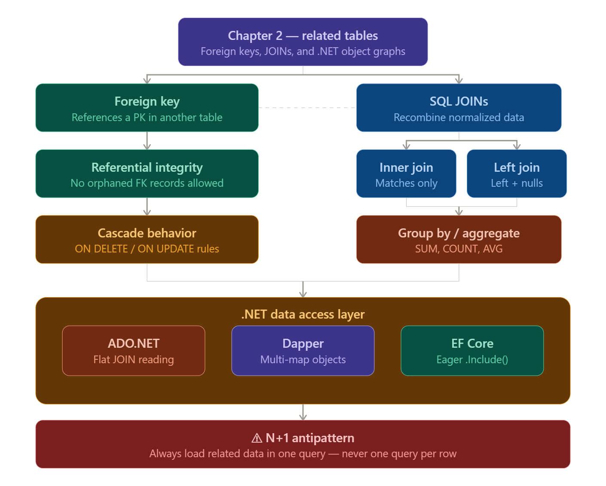
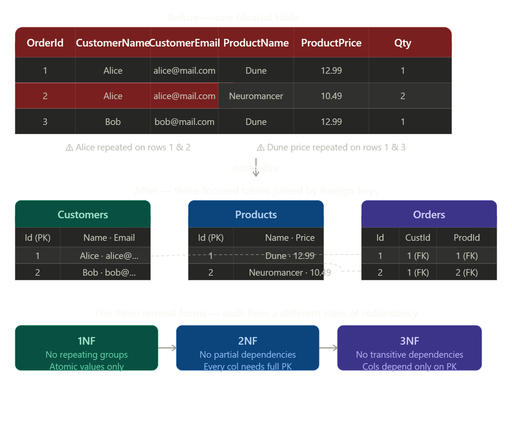
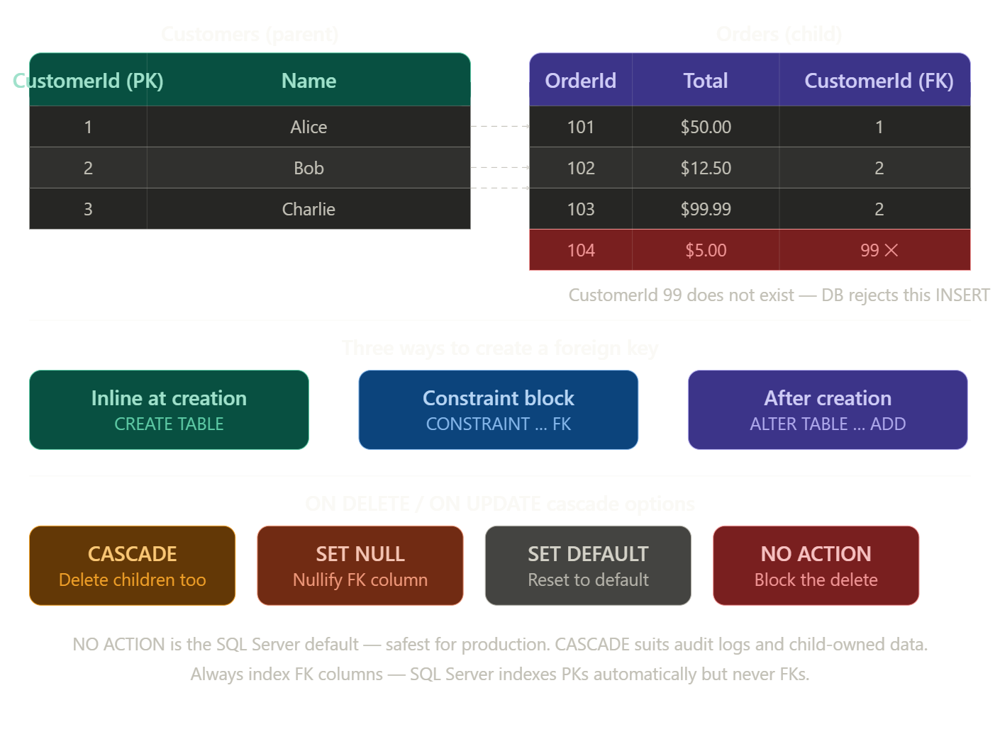
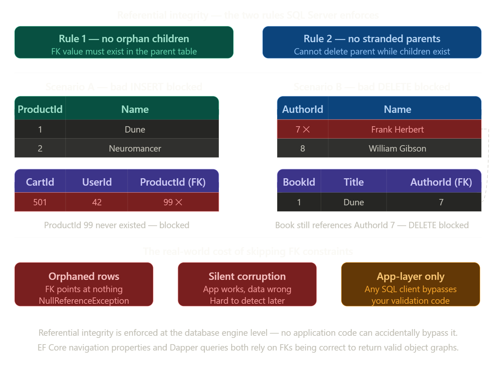
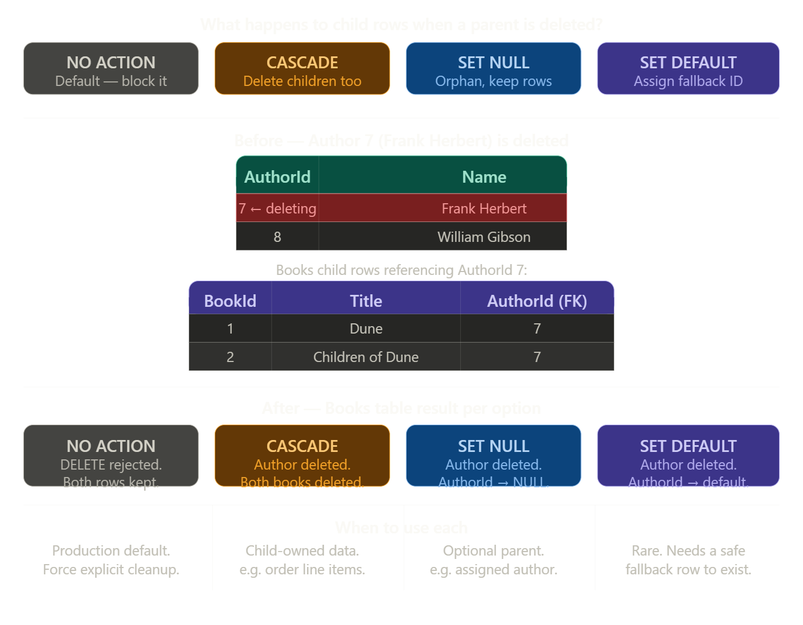

# Grokking Relational Database Design: Chapter 2 Masterclass

## Related Tables, JOINs, and .NET Data Shaping

### 1. CHAPTER OVERVIEW & LEARNING OBJECTIVES

### Chapter Summary

Chapter 2 transitions from isolated tables to a true relational ecosystem. It introduces the Foreign Key, the mechanism that links tables together, enforcing "Referential Integrity." With data now spread across multiple tables to reduce redundancy, the chapter covers advanced SQL—specifically `JOIN` operations and aggregations (`GROUP BY`)—to stitch that data back together into meaningful business information. In .NET, this chapter is critical because object-oriented programming naturally relies on nested object graphs (e.g., a `Customer` object containing a list of `Order` objects), and you must know how to shape relational data to fit those models.

### Learning Objectives

By the end of this chapter, you will be able to:

1. **Define and implement** Foreign Keys to establish relationships between tables.
2. **Explain and enforce** Referential Integrity to prevent orphaned records.
3. **Write** queries utilizing `INNER JOIN`, `LEFT JOIN`, and `RIGHT JOIN` to combine data.
4. **Aggregate** data using `GROUP BY` and functions like `SUM()`, `COUNT()`, and `AVG()`.
5. **Map** joined SQL results into nested C# object graphs using **Dapper** and **Entity Framework Core**.
6. **Solve** the "N+1 Query Problem" in .NET applications.

### Setting the Stage

Chapter 1 gave us buckets (tables). Chapter 2 gives us the pipes (relationships) connecting those buckets. This sets the stage for Chapter 3's design principles, as you cannot design a database without understanding how tables interact.

### The Key Problem Solved

_"How do we store data efficiently without duplication, yet retrieve it as a single, unified view for the application layer?"_

## 2. CONCEPT BREAKDOWN WITH VISUAL DIAGRAMS

### Concept 1: The Foreign Key & Referential Integrity

- **ELI5**: Imagine a library book that has a "Checked Out By" card. The card just has a Member ID on it. That ID is a Foreign Key. It only works if that Member ID actually exists in the library's main system (Referential Integrity).

- **Technical**: A Foreign Key (FK) is a column or group of columns in one table that uniquely identifies a row of another table (usually pointing to its Primary Key). Referential integrity ensures that you cannot insert an FK value that doesn't exist in the parent table, and you cannot delete a parent record if child records still reference it.

### Concept 2: SQL JOINs

- **Definition**: A set operation that combines columns from one or more tables into a new result set based on a related column between them.

- **Types**:
  - `INNER JOIN`: Returns records that have matching values in both tables.
  - `LEFT JOIN`: Returns all records from the left table, and the matched records from the right table (or NULLs if no match).

## Visual Diagrams

### Diagram A: Referential Integrity (ASCII Art)

```
Table: Users (Parent)                 Table: Orders (Child)
+--------+-----------+                +---------+------------+----------+
| UserId | Name      |                | OrderId | OrderTotal | UserId   |
| (PK)   |           |                | (PK)    |            | (FK)     |
+--------+-----------+                +---------+------------+----------+
| 1      | Alice     | <------------+ | 101     | $50.00     | 1        |
| 2      | Bob       | <-+          | | 102     | $12.50     | 2        |
| 3      | Charlie   |   +----------+-| 103     | $99.99     | 2        |
+--------+-----------+                | 104     | $5.00      | 99 (❌)  |
                                      +---------+------------+----------+
                                       ^ ERROR: Referential Integrity Violation!
                                         User 99 does not exist. The DB rejects this.
```

### Diagram B: INNER vs LEFT JOIN (Venn Diagrams)

```
      INNER JOIN                      LEFT JOIN
      (Intersection)                  (All Left + Intersection)
       ___       ___                   ___       ___
      /   \     /   \                 /|||\     /   \
     /  A  \___/  B  \               /|||||\___/  B  \
    |      |XXX|      |             ||||||||XXX|      |
     \     /^^^\     /               \|||||/^^^\     /
      \___/     \___/                 \|||/     \___/

  Only returns data where         Returns ALL of A. If B has no
  FK matches PK perfectly.        match, B's columns return NULL.
```

## 3. COMPREHENSIVE CODE EXAMPLES

### Level 1 - Basic Example (Raw ADO.NET with INNER JOIN)

Demonstrating how to flatten joined relational data into a simple string output.

```cs
using Microsoft.Data.SqlClient;

public class JoinDemo
{
    public static void FetchUserOrders(string connectionString)
    {
        // SQL JOIN: Stitches Users and Orders together
        const string sql = """
            SELECT u.Name, o.OrderTotal
            FROM Users u
            INNER JOIN Orders o ON u.UserId = o.UserId
            WHERE u.UserId = @UserId
            """;

        using SqlConnection conn = new(connectionString);
        using SqlCommand cmd = new(sql, conn);
        cmd.Parameters.AddWithValue("@UserId", 2); // Bob

        conn.Open();
        using SqlDataReader reader = cmd.ExecuteReader();

        Console.WriteLine("Bob's Orders:");
        while (reader.Read())
        {
            // Flat reading of joined data
            string name = reader.GetString(0);
            decimal total = reader.GetDecimal(1);
            Console.WriteLine($"{name} ordered: ${total}");
        }
    }
}
```

### Level 2 - Realistic Example (Dapper Multi-Mapping)

In .NET, we don't want flat data; we want object graphs. Here, Dapper maps an `INNER JOIN` into a nested C# object.

```cs
using Dapper;
using Microsoft.Data.SqlClient;

// 1. C# Object Graph
public class User
{
  public int UserId { get; set; }
  public string Name { get; set; } = "";
  public List<Order> Orders { get; set; } = []; // Nested collection
}

public class Order
{
  public int OrderId { get; set; }
  public decimal OrderTotal { get; set; }
}

public class OrderRepository(string connectionString)
{
  public async Task<User?> GetUserWithOrdersAsync(int userId)
  {
    const string sql = """
        SELECT u.UserId, u.Name, o.OrderId, o.OrderTotal
        FROM Users u
        LEFT JOIN Orders o ON u.UserId = o.UserId
        WHERE u.UserId = @Id
        """;

    await using SqlConnection conn = new(connectionString);

    var userDictionary = new Dictionary<int, User>();

    // Dapper Multi-Mapping: Maps the joined row to User and Order objects
    await conn.QueryAsync<User, Order, User>(
      sql,
      (user, order) =>
      {
        if (!userDictionary.TryGetValue(user.UserId, out var currentUser))
        {
          currentUser = user;
          userDictionary.Add(currentUser.UserId, currentUser);
        }

        if (order != null)
          currentUser.Orders.Add(order);

        return currentUser;
      },
      new { Id = userId },
      splitOn: "OrderId" // Tells Dapper where the Order object begins in the SQL columns
    );

    return userDictionary.Values.FirstOrDefault();
  }
}
```

## Level 3 - Advanced Example (EF Core Navigation Properties)

### Entity Framework Core handles the JOINs for you using LINQ and `.Include()`.

```cs
using Microsoft.EntityFrameworkCore;

// 1. Entities with Navigation Properties
public class Customer
{
  public int Id { get; set; }
  public required string Name { get; set; }

  // Navigation Property indicating a 1-to-Many relationship
  public ICollection<Invoice> Invoices { get; set; } = new List<Invoice>();
}

public class Invoice
{
  public int Id { get; set; }
  public decimal Amount { get; set; }

  // Foreign Key backing field
  public int CustomerId { get; set; }
  // Navigation Property pointing back to parent
  public Customer Customer { get; set; } = null!;
}

// 2. The Service Layer
public class CustomerService(DbContext context)
{
  public async Task<List<Customer>> GetHighValueCustomersAsync()
  {
    // ❌ THE N+1 PROBLEM (Anti-pattern):
    // var customers = await context.Customers.ToListAsync();
    // foreach(var c in customers) { var inv = context.Invoices.Where(i => i.CustomerId == c.Id).ToList(); }
    // Result: 1 query for customers, N queries for invoices. Kills performance.

    // ✅ THE RIGHT WAY: Eager Loading with .Include()
    // EF Core translates this into a single LEFT JOIN in SQL.
    return await context.Customers
      .Include(c => c.Invoices) // Triggers the SQL JOIN
      .Where(c => c.Invoices.Sum(i => i.Amount) > 1000m) // SQL GROUP BY / HAVING translation
      .ToListAsync();
  }
}
```

## 4. HANDS-ON CODING EXERCISES

### Exercise 1: The Matchmaker (SQL JOINs)

**Difficulty**: Intermediate
**Time Estimate**: 20 minutes
**Objective**: Write a query that combines `Departments` and `Employees`.

**Requirements**:

1. Return Department Name, Employee Name, and Salary.
2. Include ALL departments, even if they have 0 employees (Hint: use `LEFT JOIN`).
3. Order the results by Department Name alphabetically.

### Exercise 2: EF Core Relationship Builder

**Difficulty**: Advanced
**Time Estimate**: 30 minutes
**Objective**: Configure a 1-to-Many relationship in C# using EF Core Fluent API.
**Requirements**: Create an `Author` and `Book` class. Use the `OnModelCreating` method in your `DbContext` to explicitly configure the `AuthorId` as a Foreign Key that `Cascade Deletes` (if an author is deleted, delete their books).

## 5. REAL-WORLD SCENARIOS & CASE STUDIES

### Scenario: The Orphaned Cart Problem

**Before**: An e-commerce startup built their database without Foreign Keys "to save time." A bug allowed administrators to delete products from the `Products` table. However, thousands of users still had those `ProductIds` in their `ShoppingCartItems` table. When the app tried to render the cart, it crashed with `NullReferenceExceptions` because the product data was gone.
**After (Applying Chapter 2)**: They added a Foreign Key constraint: `ALTER TABLE ShoppingCartItems ADD CONSTRAINT FK_Cart_Product FOREIGN KEY (ProductId) REFERENCES Products(Id)`.

- **Result**: Now, if an admin tries to delete a product that is in someone's cart, SQL Server throws an exception, blocking the deletion and preventing app crashes. Data integrity is preserved at the lowest level.

## 6. CONCEPT CONNECTIONS & RELATIONSHIPS

### Concept Map:

```
[Chapter 1: Primary Keys]
          |
          v
(Referenced by)
          |
[Chapter 2: Foreign Keys] ---> forces ---> [Referential Integrity]
          |                                        |
          v                                        v
[SQL JOINs] <--------- maps to --------> [.NET Navigation Properties]
```

## 7. DEEP DIVE SECTIONS

### Under the Hood: Indexes on Foreign Keys

By default, SQL Server automatically creates an index on Primary Keys (to enforce uniqueness and speed up lookups). **It does NOT automatically index Foreign Keys**. When you execute an `INNER JOIN Orders ON Users.Id = Orders.UserId`, SQL Server has to scan the `Orders` table to find the matching `UserId`. If Orders has 10 million rows, this is painfully slow.

- **Pro-Tip**: In production .NET apps, _always_ create an index on your Foreign Key columns. EF Core does this automatically for you, which is one of its hidden benefits!

## 8. INTERACTIVE LEARNING ACTIVITIES

### Code Analysis Challenge

**Identify the issue**:

```sql
SELECT c.CategoryName, COUNT(p.ProductId)
FROM Categories c
INNER JOIN Products p ON c.CategoryId = p.CategoryId
```

- **Issues to identify**:

1. Missing `GROUP BY`. You cannot select a raw column (`CategoryName`) alongside an aggregate function (`COUNT`) without grouping by that raw column.
2. If a Category has 0 products, it won't show up. It should be a `LEFT JOIN`.

## 9. KNOWLEDGE VALIDATION

### Conceptual Questions

- **Q**: Can a Foreign Key reference a column that is not a Primary Key?
  - **A**: Yes, but it MUST reference a column with a `UNIQUE` constraint. It must point to a guaranteed unique value.

- **Q**: What is the "N+1 Problem" in ORMs?
  - **A**: It's when an ORM executes 1 query to get a list of parent records, and then N additional queries to get the child records for each parent, instead of using a single `JOIN`.

## 10. SUPPLEMENTARY RESOURCES

- **Microsoft Docs**: [Loading Related Data in EF Core](https://learn.microsoft.com/en-us/ef/core/querying/related-data/)
- **Video**: Search YouTube for "Dapper Multi-Mapping Tutorial .NET 8".

## 11. STUDY STRATEGIES FOR THIS CHAPTER

- **Mental Model**: Think of `INNER JOIN` as a strict bouncer. Both tables must be on the list. Think of `LEFT JOIN` as a VIP host; the left table gets in no matter what, and the right table comes along if they are attached.
- **Practice**: Don't just read JOINs. Draw two circles on paper, put numbers in them, and manually calculate the result set.

## 12. PRACTICAL PROJECT: CHAPTER 2 CAPSTONE

### Project: The Blog Engine

1. **SQL Phase**: Create `Authors` (Id, Name) and `Posts` (Id, Title, Content, AuthorId). Add a Foreign Key constraint.

2. **C# Phase**: Write an API endpoint that returns a list of Authors, and nested inside each author, an array of their Posts. Use EF Core `.Include()` to do this in a single query.

3. **Validation**: Try to insert a `Post` with an `AuthorId` of `9999`. Ensure SQL throws a referential integrity error.

## 13. TROUBLESHOOTING & FAQ

- **Q: Why are my `LEFT JOIN` columns coming back null in C#?**
  - **A**: Because the right side of the join had no match! In C#, ensure properties mapping to the right side of a `LEFT JOIN` are nullable (e.g., `int?` instead of `int`).

- **Q: EF Core is giving me a tracking loop error when I serialize to JSON.**
  - **A**: When `User` includes `Order`, and `Order` includes `User`, JSON serializers get stuck in an infinite loop. Use `[JsonIgnore]` on the child's parent reference, or map to a DTO (Data Transfer Object).

# Summary



### Here's how to read the diagram top to bottom:

**Chapter 2's central thesis** — normalized data splits facts across multiple tables to eliminate duplication. The two mechanisms that make this work are the Foreign Key (how tables link) and SQL JOINs (how you query across those links). The dashed line between them shows they're two sides of the same coin.

**Left column** traces the data integrity story: a Foreign Key enforces Referential Integrity — you can't insert an order for a customer that doesn't exist. Cascade Behavior then defines what happens when a parent row is deleted or updated (`ON DELETE CASCADE`, `ON DELETE RESTRICT`, etc.).

**Right column** traces the querying story: SQL JOINs split into the two types covered in the chapter — Inner Join returns only rows where both sides match, Left Join returns everything from the left table and nulls where the right has no match. GROUP BY then sits below both because aggregation (`SUM`, `COUNT`, `AVG`) almost always operates on joined data.

**Both columns converge** into the .NET integration layer, which mirrors Chapter 1's structure — three tiers of abstraction for the same job: ADO.NET reads flat joined rows manually, Dapper's multi-mapping assembles them into nested C# objects, and EF Core's `.Include()` handles the JOIN entirely from C#.

**The N+1 warning** sits at the very bottom as a consequence of getting the .NET layer wrong — it's the most common performance mistake when moving from flat tables to object graphs.

## 1. Chapter 2 (Related Tables)



Normalization is the process of restructuring a database to reduce redundancy and prevent data anomalies. The core idea is simple: **every fact should be stored exactly once**. When a fact lives in multiple places, the database can become inconsistent — updating a price in one row but not another, for example. Splitting data into focused tables connected by foreign keys is how you achieve that.

---

### The problem with one big table

The diagram's "before" table shows the classic symptom: Alice's name and email appear on rows 1 and 2 because she placed two orders. Dune's price of 12.99 appears on rows 1 and 3 because two customers bought it. This redundancy creates three types of anomaly:

- **Update anomaly** — if Dune's price changes to 14.99, you must update every row that mentions Dune. Miss one and the database now holds two different prices for the same product.
- **Insert anomaly** — you can't record a new product until someone actually orders it, because there's no order row to put it in.
- **Delete anomaly** — if Bob cancels his only order, you lose the fact that Dune costs 12.99 entirely, because that knowledge was only stored alongside the order.

---

### The solution — three focused tables

The "after" state stores each fact once: Alice's email lives only in `Customers`, Dune's price lives only in `Products`, and `Orders` contains only the relationship between them — two foreign keys pointing at the relevant customer and product rows. To answer "what did Alice order and at what price?", you use a `JOIN` to reassemble the data at query time.

---

### The three normal forms

Normalization is typically taught as a progression of rules, each eliminating a different class of redundancy. The bottom row of the diagram shows them as a chain — each builds on the previous.

**1NF — atomic values, no repeating groups.** Every cell must hold a single value. A column like `"Dune, Neuromancer, The Martian"` in one cell violates 1NF. Each value gets its own row.

**2NF — no partial dependencies.** Every non-key column must depend on the _whole_ primary key, not just part of it. This mainly matters when a table has a composite primary key. If a table has `(OrderId, ProductId)` as a PK but stores `ProductName` — which only depends on `ProductId`, not the full key — that's a partial dependency. `ProductName` belongs in `Products`.

**3NF — no transitive dependencies.** Every non-key column must depend _directly_ on the primary key, not on another non-key column. If an `Orders` table stored both `CustomerId` and `CustomerEmail`, the email depends on the customer — not the order. It belongs in `Customers`.

---

### The trade-off normalization introduces

The cost of normalization is that data you once read in a single table scan now requires a `JOIN`. This is exactly why Chapter 2 covers `JOIN`s immediately after introducing foreign keys — normalization and `JOIN`s are inseparable. You normalize to write data cleanly, you `JOIN` to read it back together.

## 1.1 Foreign Key (References a PK in another table)



A foreign key is a column in one table whose value must match an existing primary key value in another table. It is the physical mechanism that enforces the relationship between two tables — the "pipe" that connects them.

---

### The three ways to declare a FK

**Option 1 — inline, at table creation (simplest)**

```sql
CREATE TABLE Orders (
    OrderId INT IDENTITY(1,1) PRIMARY KEY,
    Total DECIMAL(10,2) NOT NULL,
    CustomerId INT NOT NULL
      REFERENCES Customers(CustomerId)   -- FK declared inline
);
```

**Option 2 — named constraint block (recommended for production)**

Naming the constraint lets you reference it later in `ALTER` or error messages:

```sql
CREATE TABLE Orders (
    OrderId INT IDENTITY(1,1) PRIMARY KEY,
    Total DECIMAL(10,2) NOT NULL,
    CustomerId INT NOT NULL,

    CONSTRAINT FK_Orders_Customers
      FOREIGN KEY (CustomerId)
      REFERENCES Customers(CustomerId)
      ON DELETE NO ACTION
      ON UPDATE CASCADE
);
```

**Option 3 — alter an existing table (when the table already exists)**

```sql
ALTER TABLE Orders
ADD CONSTRAINT FK_Orders_Customers
  FOREIGN KEY (CustomerId)
  REFERENCES Customers(CustomerId);
```

---

### What referential integrity actually enforces

With the FK in place, SQL Server enforces two rules automatically with no extra code:

```sql
-- ✅ Allowed — CustomerId 1 (Alice) exists
INSERT INTO Orders (Total, CustomerId) VALUES (50.00, 1);

-- ❌ Blocked — CustomerId 99 does not exist in Customers
INSERT INTO Orders (Total, CustomerId) VALUES (5.00, 99);
-- Msg 547: The INSERT statement conflicted with the FOREIGN KEY constraint

-- ❌ Blocked — Bob has orders, can't delete him without resolving them first
DELETE FROM Customers WHERE CustomerId = 2;
-- Msg 547: The DELETE statement conflicted with the REFERENCE constraint
```

---

### Choosing the right cascade behaviour

The cascade option controls what happens to child rows when the parent is deleted or updated:

| Option        | What happens to Orders when a Customer is deleted |
| ------------- | ------------------------------------------------- |
| `NO ACTION`   | Blocks the delete — SQL Server default, safest    |
| `CASCADE`     | Deletes all the customer's orders automatically   |
| `SET NULL`    | Sets `CustomerId` to NULL on orphaned orders      |
| `SET DEFAULT` | Resets `CustomerId` to the column's default value |

`NO ACTION` is the right default for most production scenarios — it forces you to consciously handle the child data before removing a parent. `CASCADE` is appropriate for data that has no meaning without its parent, such as order line items belonging to an order.

---

### The FK index you must add manually

SQL Server creates an index on primary keys automatically. It does **not** create one on foreign key columns. Every `JOIN` on `Orders.CustomerId` without an index causes a full table scan:

```sql
-- Always add this after creating the FK
CREATE INDEX IX_Orders_CustomerId
ON Orders (CustomerId);
```

EF Core does this for you silently — one of its practical advantages over writing DDL by hand.

## 1.1.1 Referential Integrity (No isolated FK records allowed)



Referential integrity is the guarantee that **every foreign key value in a child table points to a real, existing row in the parent table**. SQL Server enforces it automatically the moment a `FOREIGN KEY` constraint exists — no application code required.

It collapses into two rules, shown in the diagram's two scenarios:

---

### Rule 1 — you cannot insert a child row with a non-existent FK value

```sql
-- ProductId 99 doesn't exist in Products
INSERT INTO CartItems (UserId, ProductId)
VALUES (42, 99);

-- SQL Server response:
-- Msg 547: The INSERT statement conflicted with the
-- FOREIGN KEY constraint "FK_CartItems_Products".
```

The database engine checks the parent table _before_ writing the row. If the FK value isn't found, the insert is rejected entirely — the row never reaches disk.

---

### Rule 2 — you cannot delete a parent row while children still reference it

```sql
-- Author 7 (Frank Herbert) still has books in the Books table
DELETE FROM Authors WHERE AuthorId = 7;

-- SQL Server response:
-- Msg 547: The DELETE statement conflicted with the
-- REFERENCE constraint "FK_Books_Authors".
```

To delete the author you must first either delete their books, reassign them to another author, or configure `ON DELETE CASCADE` to do it automatically. The database will not leave orphaned book rows behind.

---

### Why enforcement must live in the database, not the application

This is the critical architectural point. Consider what happens without a FK constraint:

```csharp
// Your .NET service validates before deleting
public async Task DeleteProductAsync(int productId)
{
  bool hasCartItems = await context.CartItems
    .AnyAsync(c => c.ProductId == productId);

  if (hasCartItems) throw new InvalidOperationException("Product is in a cart.");

  context.Products.Remove(product);
  await context.SaveChangesAsync();
}
```

This looks safe, but it has a race condition — two requests could check `AnyAsync` simultaneously, both see no cart items, and both proceed to delete. More critically, **any other SQL client** — a migration script, a reporting tool, a developer running a query manually — can bypass your C# validation entirely and delete the row directly.

A FK constraint has no such weakness. It operates at the storage engine level, below every application layer, enforced on every connection regardless of what wrote the SQL.

---

### What referential integrity prevents in the real world

The chapter's e-commerce scenario is the clearest example: without a FK between `ShoppingCartItems.ProductId` and `Products.ProductId`, deleting a product leaves cart rows pointing at nothing. When the app later tries to render the cart and joins to `Products`, those rows return `NULL` — causing `NullReferenceException` in .NET code that wasn't written to handle missing products.

The fix is one `ALTER TABLE` statement. After that, SQL Server blocks the problematic delete at the source and the bug becomes impossible.

## Cascade Behavior (ON DELETE / ON UPDATE rule)



`ON DELETE CASCADE` and `ON UPDATE CASCADE` are rules attached to a foreign key constraint that tell SQL Server what to do automatically to child rows when the parent row is deleted or its primary key is updated. Without them, both operations are blocked by default.

---

### The syntax

```sql
CREATE TABLE Books (
    BookId INT IDENTITY(1,1) PRIMARY KEY,
    Title VARCHAR(255) NOT NULL,
    AuthorId INT NULL,

    CONSTRAINT FK_Books_Authors
      FOREIGN KEY (AuthorId)
      REFERENCES Authors(AuthorId)
      ON DELETE CASCADE      -- delete the book if author is deleted
      ON UPDATE CASCADE      -- update AuthorId if author's PK changes
);
```

You can mix the two independently — `ON DELETE CASCADE` with `ON UPDATE NO ACTION` is a common combination.

---

### ON DELETE CASCADE — what it actually does

```sql
-- This single statement...
DELETE FROM Authors WHERE AuthorId = 7;

-- ...automatically also runs:
-- DELETE FROM Books WHERE AuthorId = 7
-- behind the scenes, in the same transaction.
```

The cascade fires inside the same atomic transaction. If the child delete fails for any reason, the parent delete is rolled back too. Nothing is left in a half-deleted state.

---

### ON UPDATE CASCADE — rarer but useful

```sql
-- If you reassign an author's ID (unusual but possible)
UPDATE Authors SET AuthorId = 99 WHERE AuthorId = 7;

-- All Books rows with AuthorId = 7 automatically become AuthorId = 99
```

In practice, `ON UPDATE CASCADE` matters most when the parent table's PK is a natural key (like an ISBN or a country code) rather than a surrogate integer — those are the values that occasionally need to change.

---

### Choosing the right option for real scenarios

**Use `CASCADE`** when the child data has no independent meaning without the parent. Order line items without an order, comments without a post, addresses belonging exclusively to a deleted user — these are all good cascade candidates. Deleting the parent should logically destroy the children.

**Use `SET NULL`** when the relationship is optional. A book might have an assigned editor, but if that editor account is deleted the book itself should survive — just unassigned. The FK column must be nullable (`INT NULL`) for this to work.

**Use `NO ACTION` (the default)** for most production tables. It forces your application or migration script to explicitly handle children before the parent can be removed. This is the safest option because it makes the dependency visible and intentional rather than silent.

**Avoid `CASCADE` on wide chains.** If `Authors` cascades to `Books`, and `Books` cascades to `Reviews`, deleting one author silently deletes every book and every review. In a large schema this becomes very hard to reason about, and SQL Server will reject circular cascade paths entirely with a schema error.

---

### EF Core configuration

```csharp
modelBuilder.Entity<Book>()
  .HasOne(b => b.Author)
  .WithMany(a => a.Books)
  .HasForeignKey(b => b.AuthorId)
  .OnDelete(DeleteBehavior.Cascade);  // maps to ON DELETE CASCADE
```

EF Core's `DeleteBehavior` enum maps directly to the SQL Server options: `Cascade`, `SetNull`, `Restrict` (equivalent to `NO ACTION`), and `ClientSetNull` (handled in memory rather than by the DB engine).

## 1.2 SQL JOINs (Recombining Normalized Data)
